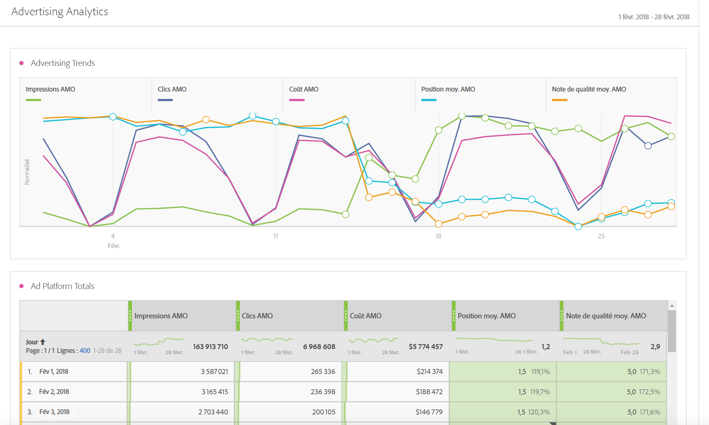
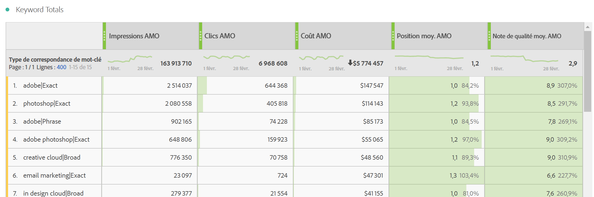
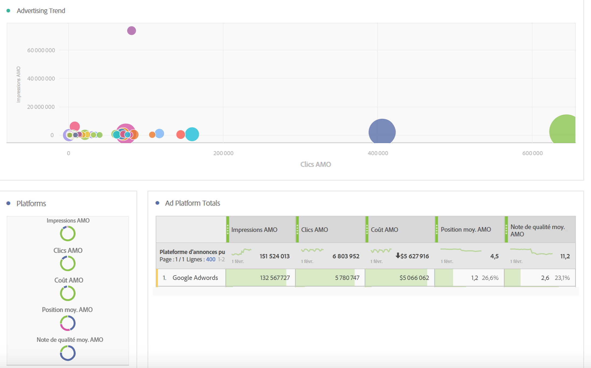
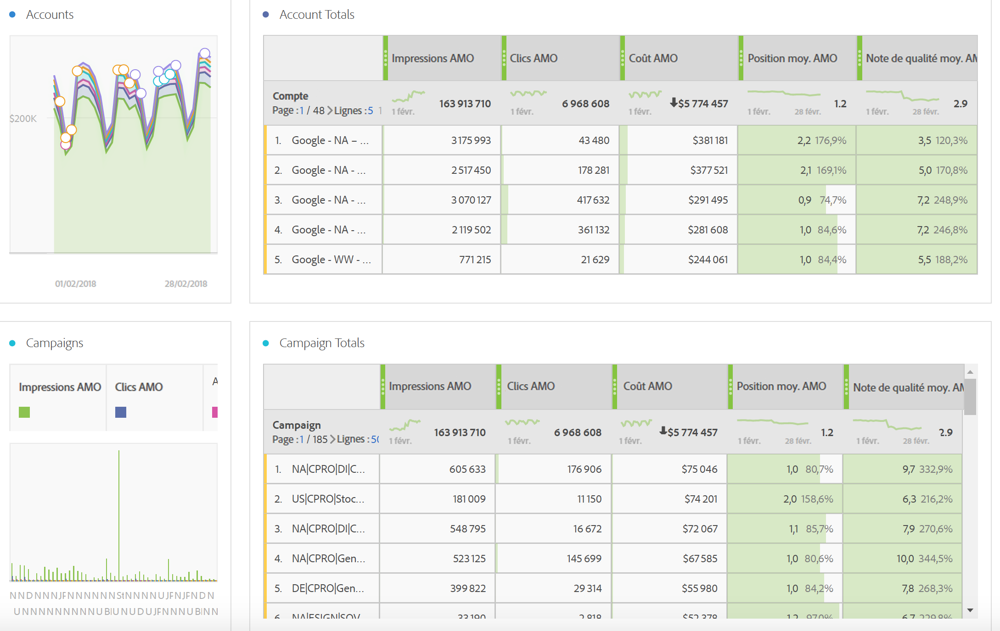
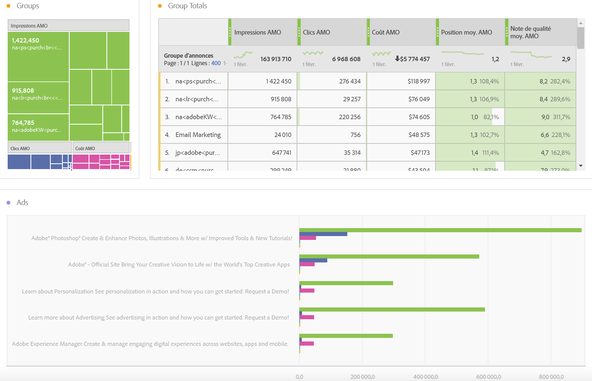
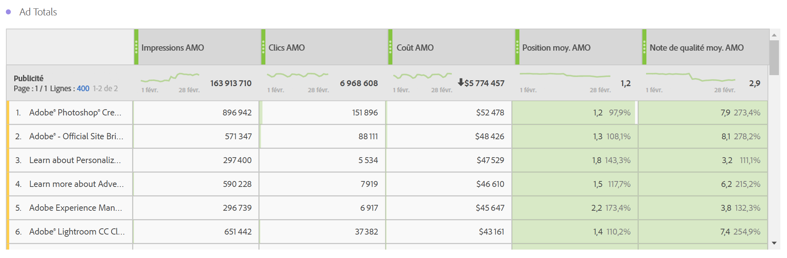
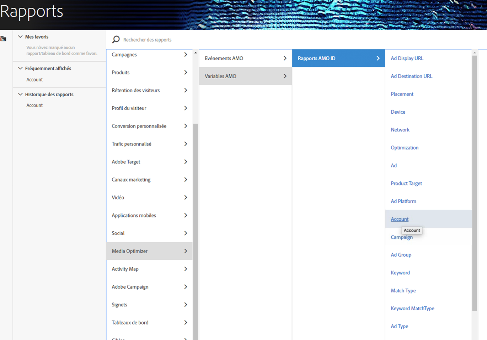

# Rapport sur les données Advertising dans Adobe Analytics

Détails sur le modèle Analysis Workspace et sur la création de rapports dans Reports &amp; Analytics, ainsi que dans Report Builder.

> [!NOTE] Patientez 24 heures au moins avant que les données du moteur de recherche ne commencent à apparaître dans vos rapports Analytics. Notez également que le reporting Analytics ne renverra pas de données pour la granularité horaire, car les données AMO ne prennent pas en charge ce type de granularité.

## Analysis Workspace : Moteurs de recherche {#section_8173F42B2C784F41B9FD82CBB66F9ADF}

Ce modèle permet à quiconque mettant en œuvre une intégration de moteur de recherche d’accéder à de nombreuses données de moteur de recherche dans Analytics. Vous pouvez y accéder via **[!UICONTROL Workspace]** > **[!UICONTROL Modèles]** > **[!UICONTROL Advertising]** > **[!UICONTROL Moteurs de recherche.]**

>[!NOTE]
>
>La catégorie de modèle Advertising est visible par tous les clients, y compris ceux qui n’ont implémenté aucun compte Advertising. Cependant, si vous tentez d’ouvrir le modèle Moteurs de recherche pour une entreprise dont la configuration n’a pas été effectuée, un message d’erreur vous indiquera que vous n’avez encore configuré aucun compte de moteur de recherche. Dans ce cas, cliquez sur **[!UICONTROL Configurer maintenant]**, vous serez alors dirigé vers l’écran [Configuration d’un compte Advertising](/help/integrate/c-advertising-analytics/c-adanalytics-workflow/aa-create-ad-account.md).

       

| Tableau/Visualisation | Description |
|--- |--- |
| Tendances publicitaires | Présentation des tendances quotidiennes pour les Impressions AMO, les Clics AMO et le Coût AMO. |
| Plateformes d’annonces publicitaires | Graphique en anneau pour les coûts des deux plateformes principales (Google, Bing). |
| Totaux des plateformes d’annonces publicitaires | Tableau à structure libre des plateformes principales ventilé selon les Impressions AMO, les Clics AMO, le Coût AMO, la position moyenne AMO et la note de qualité AMO. |
| Comptes | Zone empilée de coûts. |
| Totaux de comptes | Tableau à structure libre des comptes principaux ventilé selon des mesures associées. |
| Campagnes | Graphique à barres du coût de la campagne. |
| Totaux de la campagne | Tableau à structure libre des campagnes principales ventilé selon des mesures associées. |
| Groupes | Arborescence des coûts. |
| Totaux des groupes | Tableau à structure libre des principaux groupes publicitaires ventilé selon des mesures associées. |
| Publicités | Graphique à barres horizontales des impressions, des clics et des coûts. |
| Totaux des annonces publicitaires | Tableau à structure libre des principales publicités ventilé selon des mesures associées. |
| Mots-clés | Graphique de dispersion des impressions, des clics et des coûts pour toutes les combinaisons de mots-clés/types de correspondance. |
| Totaux des mots-clés | Tableau à structure libre des principales combinaisons de mots-clés/types de correspondance ventilé selon des mesures associées. |

## Reports &amp; Analytics {#section_BB2E75DF909C49EA8D4E92D14D6DFD85}

Dès que vous avez configuré un compte Advertising Analytics, un rapport Advertising Analytics sera disponible.

## Report Builder {#section_8E0371CF81144C33990D909685D1726E}

Dès que vous avez configuré un compte Advertising Analytics, un rapport Advertising Analytics sera disponible.
