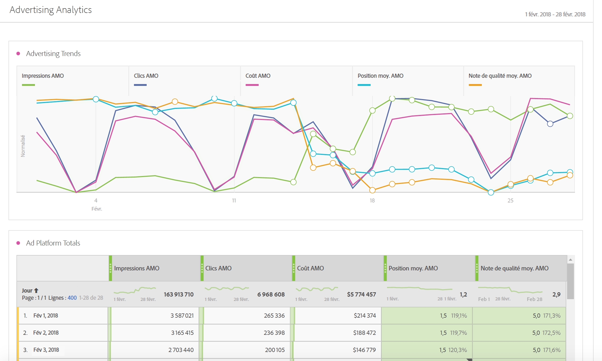
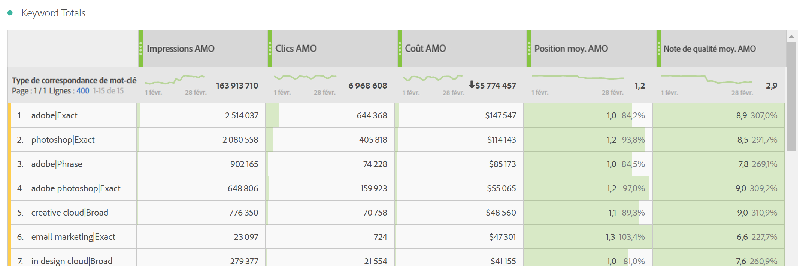
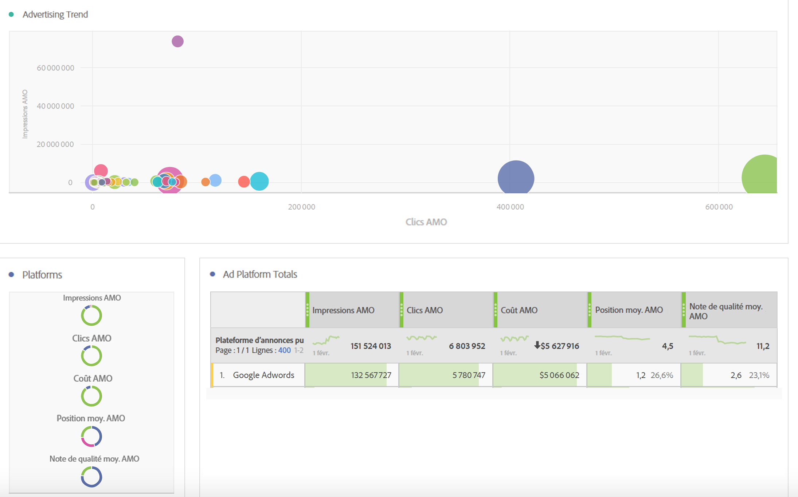
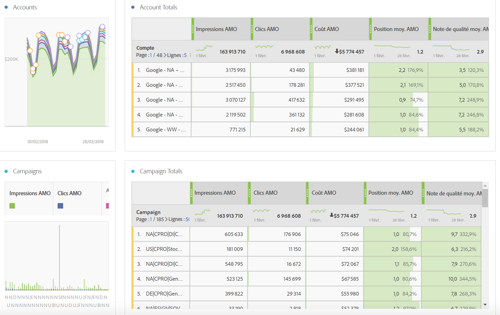
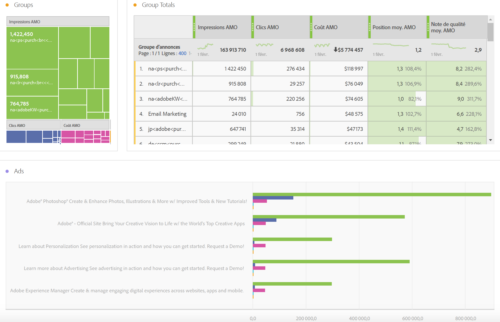
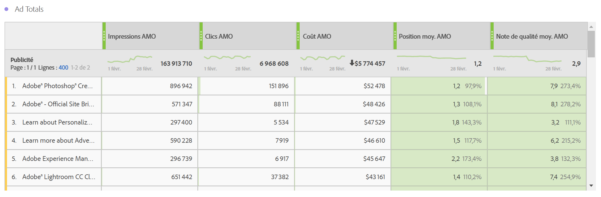

# Rapport sur les données publicitaires

Cet article fournit des détails sur le rapport Analysis Workspace et le reporting dans Report Builder.

>[!NOTE]
>
>Patientez au moins 24 heures avant que les données des moteurs de recherche ne commencent à remplir les rapports Analytics. La création de rapports Analytics ne renvoie pas de données avec une granularité horaire, car les données Adobe Advertising ne prennent pas en charge la granularité horaire.

## Rapport de référencement payant {#section_8173F42B2C784F41B9FD82CBB66F9ADF}

Ce rapport permet à toute personne implémentant l’intégration du moteur de recherche d’accéder aux données du moteur de recherche dans Analytics. Vous pouvez y accéder via **&#x200B;**&#x200B;> **[!UICONTROL Reports]** > **[!UICONTROL Acquisition]** > **[!UICONTROL Advertising Analytics : référencement payant]**

>[!NOTE]
>
>Le rapport de référencement payant est visible par tous les clients, même si vous n’avez implémenté aucun compte Advertising. Si vous essayez d’ouvrir le rapport de référencement payant pour une société qui n’est pas configurée, un message d’erreur vous expliquera que vous n’avez configuré aucun compte de moteur de recherche. Sélectionnez **[!UICONTROL Configurer maintenant]** pour accéder à l’écran [Configuration du compte Advertising](/help/integrate/c-advertising-analytics/c-adanalytics-workflow/aa-create-ad-account.md).

       

| Tableau/Visualisation | Description |
|--- |--- |
| Tendances publicitaires | Présentation des tendances quotidiennes pour les Impressions AMO, les Clics AMO et le Coût AMO. |
| Plateformes d’annonces publicitaires | Graphique en anneau pour le coût des 2 principales plateformes (Google Ads, Microsoft Advertising). |
| Totaux des plateformes d’annonces publicitaires | Tableau à structure libre des plateformes principales ventilé selon les Impressions AMO, les Clics AMO, le Coût AMO, la position moyenne AMO et la note note de qualité moyenne. |
| Comptes | Zone empilée de coûts. |
| Totaux de comptes | Tableau à structure libre des comptes principaux ventilé selon des mesures associées. |
| Campagnes | Graphique en barres du coût de la campagne. |
| Totaux de la campagne | Tableau à structure libre des campagnes principales ventilé selon des mesures associées. |
| Groupes | Arborescence des coûts. |
| Totaux des groupes | Tableau à structure libre des principaux groupes publicitaires ventilé selon des mesures associées. |
| Publicités | Graphique en barres horizontales des impressions, des clics et des coûts. |
| Totaux des annonces publicitaires | Tableau à structure libre des principales publicités ventilé selon des mesures associées. |
| Mots-clés | Graphique de dispersion des impressions, des clics et des coûts pour toutes les combinaisons de mots-clés/types de correspondance. |
| Totaux des mots-clés | Tableau à structure libre des principales combinaisons de mots-clés/types de correspondance ventilé selon des mesures associées. |

## Report Builder {#section_8E0371CF81144C33990D909685D1726E}

Dès que vous avez configuré un compte Advertising Analytics, le rapport Advertising Analytics est disponible.
