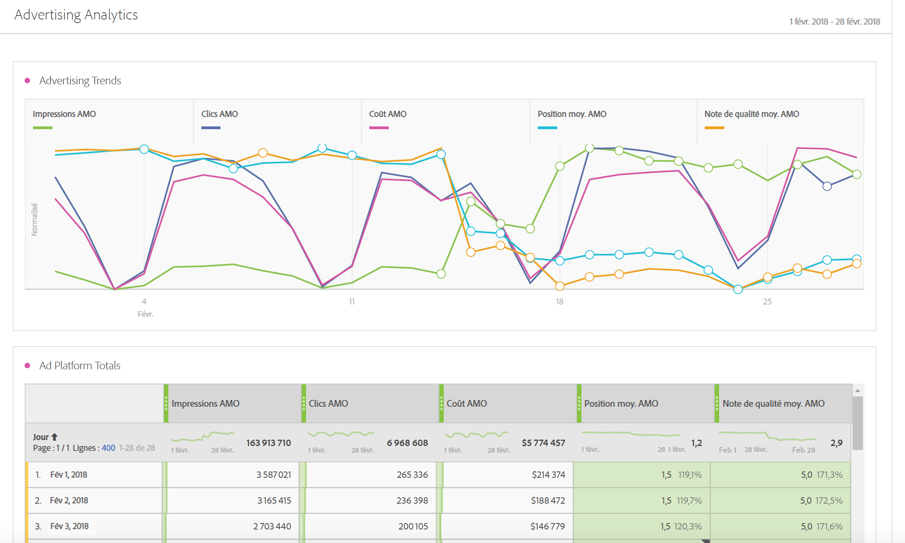

# Advertising Analytics

Advertising Analytics permet d’afficher toutes vos données de référencement payant Google et Bing côte à côte dans Adobe Analytics. Auparavant, toutes les données Google AdWords/DFA ou Microsoft Bing Ads devaient être affichées dans Adobe Advertising Cloud (AMO) ou dans Google/Bing. Vous pouvez désormais obtenir les données suivantes dans Adobe Analytics : des données sur les impressions, les clics et les coûts, directement à partir des moteurs de recherche ainsi que les instances AMO ID (instances de clics).

En réunissant les données des moteurs de recherche dans Adobe Analytics, vous pouvez analyser les mêmes données en utilisant la puissance d’Analysis Workspace. Le nouveau modèle [Performance de référencement payant](/help/integrate/c-advertising-analytics/c-adanalytics-workflow/aa-report-ad-data-an.md) dans Workspace facilite cette analyse.

Cette intégration est destinée aux audiences ci-dessous :

* Les **analystes** qui doivent collecter des rapports de performance pour les spécialistes marketing du référencement payant.
* Les **spécialistes marketing du référencement payant** qui souhaitent répondre à ces questions : quelle est la quantité de trafic que j’envoie vers notre site et que les clients convertissent ? Quelles sont mes campagnes publicitaires rentables ?

>[!BEGINSHADEBOX]

Voir  [Advertising Analytics](https://video.tv.adobe.com/v/23119?quality=12&learn=on){target="_blank"} pour une vidéo de démonstration.

>[!ENDSHADEBOX]

## Conditions préalables {#prerequisites}

* Advertising Analytics est disponible pour les SKU [Select](https://www.adobe.com/fr/data-analytics-cloud/analytics/select.html), [Prime](https://www.adobe.com/fr/data-analytics-cloud/analytics/prime.html) ou [Ultimate](https://www.adobe.com/fr/data-analytics-cloud/analytics/ultimate.html) d’Adobe Analytics.
* Cette fonctionnalité est disponible pour les clients ne bénéficiant pas d’Advertising Cloud ni d’AMO.
* Vous devez être un administrateur Adobe Analytics pour accéder à Advertising Analytics. Par la suite, vous pourrez [accorder des autorisations d’accès](/help/integrate/c-advertising-analytics/overview.md#permissions) à des non-administrateurs.
* Pour toute suite de rapports dans laquelle vous souhaitez afficher les données de recherche Google/Bing, vous devez [activer ces suites de rapports pour Advertising Analytics](/help/integrate/c-advertising-analytics/c-adanalytics-workflow/aa-provision-rs.md) (**[!UICONTROL Admin]** > **[!UICONTROL Modifier les paramètres]** > **[!UICONTROL Configuration Advertising Analytics]**).
* Vous avez besoin des informations de connexion pour un utilisateur autorisé à modifier le ou les comptes de recherche que vous souhaitez intégrer à Adobe Analytics, telles qu’un ID de compte Google et un mot de passe.
* Dans le cas de Bings Ads, les ID de client Bing sont également requis.

## Autorisations Advertising Analytics  {#permissions}

Avec Analytics, deux autorisations sont automatiquement accordées aux administrateurs Analytics. Ceux-ci peuvent ensuite choisir d’accorder ces autorisations à des non-administrateurs.

<table id="table_86256AD8B4554F369439A8FDF2F545E1"> 
 <thead> 
  <tr> 
   <th colname="col1" class="entry"> Autorisation </th> 
   <th colname="col2" class="entry"> Définition </th> 
   <th colname="col3" class="entry"> Accorder une autorisation dans Adobe Analytics </th> 
   <th colname="col4" class="entry"> Accorder une autorisation si vous êtes connecté à Adobe Experience Cloud </th> 
  </tr>
 </thead>
 <tbody> 
  <tr> 
   <td colname="col1"> 
Gestion Advertising Analytics 
 </td> 
   <td colname="col2"> 
Permet aux utilisateurs de configurer, modifier ou afficher des comptes de recherche publicitaire. 
 </td> 
   <td colname="col3">Admin &gt; Tous les administrateurs &gt; Gestion des utilisateurs &gt; Groupes &gt; Modifier l’accès à tous les rapports &gt; Personnaliser les outils Analytics &gt; Gestion Advertising Analytics </td> 
   <td colname="col4"> Connectez-vous à adminconsole.adobe.com &gt; Produits &gt; Profil des produits &gt; Onglet Autorisations &gt; Outils Analytics &gt; Gestion Advertising Analytics </td> 
  </tr> 
  <tr> 
   <td colname="col1"> 
Configuration Advertising Analytics 
 </td> 
   <td colname="col2"> 
Permet aux utilisateurs de configurer des suites de rapports à configurer pour Advertising Analytics. 
 </td> 
   <td colname="col3">Admin &gt; Tous les utilisateurs &gt; Gestion des utilisateurs &gt; Groupes &gt; Modifier l’accès à tous les rapports &gt; Personnaliser les outils de suites de rapports &gt; Configuration Advertising Analytics </td> 
   <td colname="col4"> Connectez-vous à adminconsole.adobe.com &gt; Produits &gt; Profil des produits &gt; Onglet Autorisations &gt; Outils de suites de rapports &gt; Configuration Advertising Analytics </td> 
  </tr> 
 </tbody> 
</table>

## Dimensions et mesures Advertising Analytics {#dimensions-metrics}

Advertising Analytics ajoute les dimensions et mesures suivantes à Analysis Workspace, Report Builder et à l’API de création de rapports d’Analytics.

### Dimensions

>[!IMPORTANT]
>
>Cette intégration crée un ensemble de dimensions à travers les classifications de la variable AMO ID. Ces nouvelles dimensions n’ont pas d’incidence ni ne modifient les canaux marketing existants ou les dimensions des variables de suivi de campagne. AMO ID est connectée à un profil visiteur lorsque le visiteur parvient sur un site à partir d’une annonce de référencement payant. Par conséquent, les dimensions AMO peuvent être utilisées pour ventiler les deux mesures AMO fournies par l’intégration, ainsi que toutes les données saisies en aval par le visiteur (visites, visiteurs, pages vues, taux de rebond, commandes, recettes, événements personnalisés, etc.). Elles peuvent également être ventilées par d’autres dimensions lors de la création de rapports sur d’autres mesures sur site.
>
>Les classifications pour ces mesures sont mises à jour quotidiennement. Par conséquent, si vous modifiez les métadonnées dans le moteur de recherche, il est possible que ces changements ne soient reflétés que le jour suivant la mise à jour des classifications.

| Nom de la classification (dimension) | Définition |
|--- |--- |
| Type de correspondance de mot-clé (AMO ID) | Le type de correspondance de mot-clé. Les valeurs seront généralement Large, Expression, Exact ou Aucune valeur si le type d’annonce n’a aucune correspondance. |
| Plateforme d’annonces publicitaires (AMO ID) | Le nom du moteur de recherche. Les valeurs peuvent inclure Google AdWords ou Microsoft Bing Ads. |
| Compte (AMO ID) | Le nom du compte de moteur de recherche qui est suivi. |
| Campaign (AMO ID) | Le nom de la campagne dans votre compte de moteur de recherche. |
| Groupe d’annonces (AMO ID) | Le nom du groupe d’annonces dans vos campagnes de moteur de recherche. |
| Annonce (AMO ID) | Le titre de l’annonce + la description de l’annonce utilisés dans votre annonce. |
| Mot-clé (AMO ID) | La valeur mot-clé de votre compte de moteur de recherche. |
| Type de correspondance (AMO ID) | Le type de correspondance de mot-clé attribué à votre mot-clé. Les valeurs seront généralement Large, Expression, Exact ou Aucune valeur si le type d’annonce n’a aucune correspondance. |
| Type d’annonce (AMO ID) | Le type de publicité diffusée, en général « Publicité textuelle ». |
| Titre de l’annonce (AMO ID) | L’objet Titre utilisé dans votre annonce. |
| Description de l’annonce (AMO ID) | L’objet Description de l’annonce utilisé dans votre annonce. |
| URL d’affichage de l’annonce (AMO ID) | L’objet URL d’affichage de l’annonce utilisé dans votre annonce. |
| URL de destination de l’annonce (AMO ID) | L’URL de la page de destination ou l’URL finale de votre annonce. |
| Réseau (AMO ID) | Le réseau sur lequel l’annonce est hébergée. Pour Advertising Analytics, cette valeur est toujours « Recherche ». |
| Placement (AMO ID) | Le site Web du placement géré (pour les réseaux de contenu). Seuls les placements gérés utilisent cette dimension. |
| Cible du produit (AMO ID) | Le nom de la cible du produit utilisé sur les annonces PLA (il ne s’agit pas du produit réellement acheté). |
| Optimisation (AMO ID) | Cette dimension n’est pas utilisée par Advertising Analytics. Elle n’est utilisée que par les clients bénéficiant d’Advertising Cloud. |
| Appareil (AMO ID) | Non utilisé aujourd’hui. Espace réservé à l’éventuelle amélioration future du produit pour le type d’appareil cible indiqué (p. ex. mobile, bureau) de l’annonce (et non l’appareil réel du visiteur). |

### Mesures

>[!IMPORTANT]
>
>Les mesures fournies par Advertising Analytics (répertoriées ci-dessous) sont des données synthétiques provenant des moteurs de recherche. Elles ne sont pas connectées aux profils de visiteur Analytics. Elles sont connectées uniquement à la variable AMO ID et à ses dimensions de classifications associées. Par conséquent, elles ne doivent pas faire l’objet d’un rapport par d’autres segments/dimensions que ceux basés sur les dimensions AMO ID. Si vous tentez de générer ce rapport, Analytics affichera des zéros à la place des données. Vous pouvez les inclure dans les mesures calculées, avec d’autres mesures, mais celles-ci doivent également être ventilées selon les dimensions AMO ID uniquement.
>
>Ces mesures proviennent des données d’une base journalière. Aucune donnée ne sera donc disponible pour la journée en cours. Elles ne doivent pas non plus être reportées sur une granularité inférieure à la granularité journalière.
>
>Il existe une mesure d’Instances AMO ID qui est configurée lorsqu’AMO ID est configurée sur la page de destination (c.-à-d. un clic publicitaire). Cette mesure est saisie en temps réel lors de l’accès à la page de destination et est disponible pour les ventilations avec d’autres dimensions également configurées sur la page de destination.

| Nom de la mesure | Définition |
|--- |--- |
| Impressions AMO | Le nombre d’impressions d’annonces comme indiqué par le moteur de recherche. |
| Clics AMO | Le nombre de clics sur les annonces comme indiqué par le moteur de recherche. |
| Coût AMO | Le coût payé pour chaque mot-clé/annonce comme indiqué par le moteur de recherche. |
