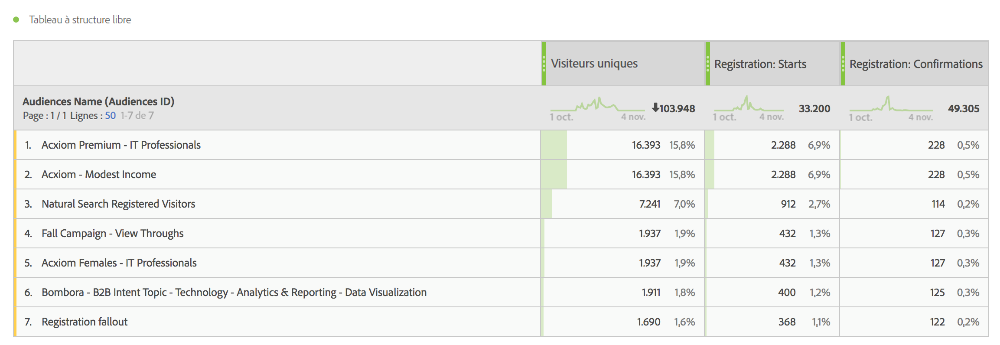
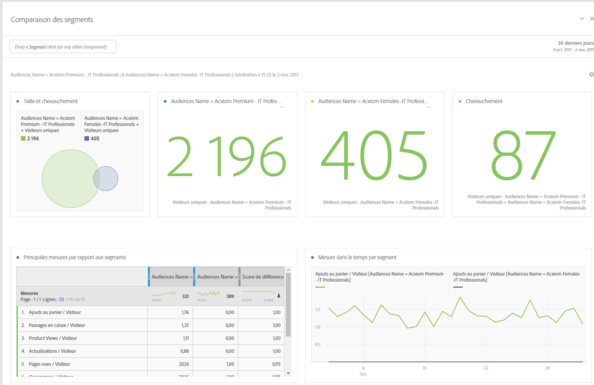
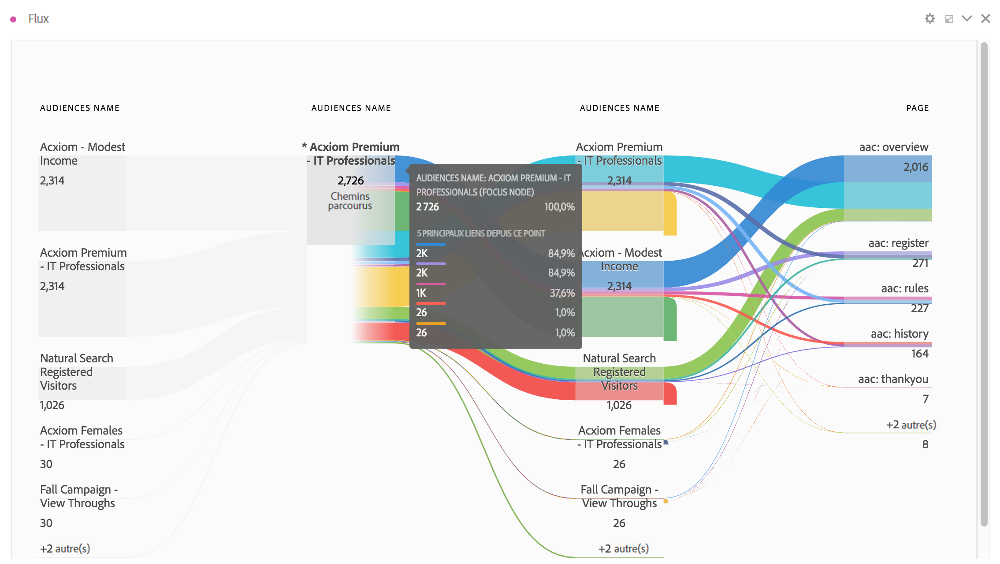
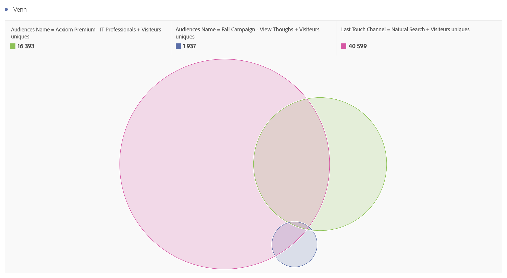
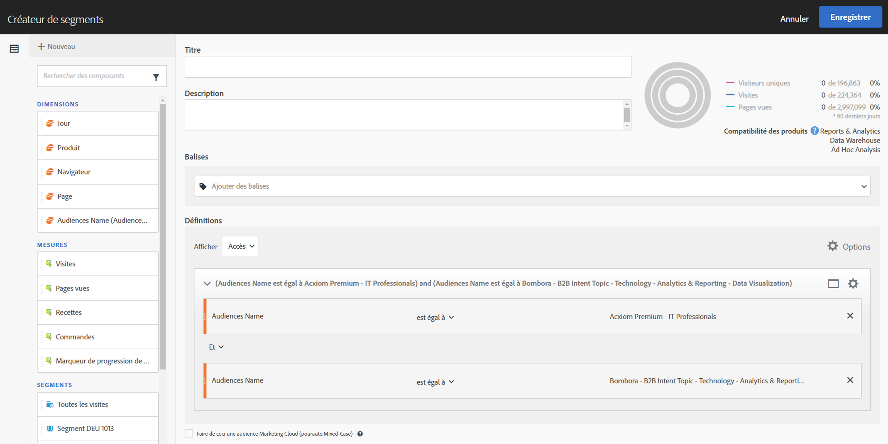
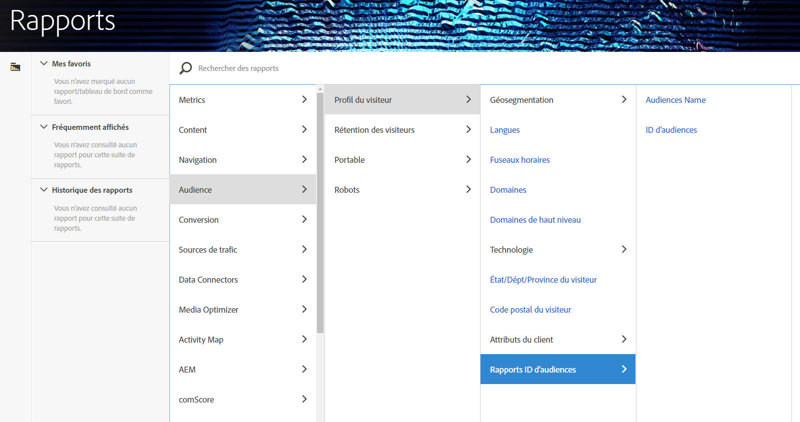

# Utilisation des données d’audience dans Analytics

Vous pouvez utiliser les dimensions d’audience AAM dans l’ensemble du module Analytics. Les segments intégrés sont de nouvelles dimensions Analytics appelées ID d’audience et Nom d’audience. Celles-ci peuvent être utilisées de la même façon que toutes les autres dimensions collectées par Analytics. Dans les flux de données, les ID d’audience sont stockés dans la colonne « mc_audiences ». Ces dimensions ne sont actuellement pas disponibles dans Data Workbench ou Livestream. Voici quelques exemples d’utilisation des dimensions d’audience:

## Analysis Workspace {#section_C70837499BEA4DED885B3486C9E02C68}

Dans Analysis Workspace, les segments AAM apparaissent sous la forme de deux dimensions.

1. Accédez à **[!UICONTROL Workspace]**.
1. Dans le  de **[!UICONTROL Dimensions]**, sélectionnez les dimensions **[!UICONTROL Audience ID]** ou **[!UICONTROL Audience Name]**. La dimension Nom d’audience est une classification conviviale de la dimension ID d’audience.

   

## Comparaison des segments  {#section_E72B80B6470C42D4B9B19BE90E6070A2}

[Comparaison des segments](https://docs.adobe.com/content/help/fr-FR/analytics/analyze/analysis-workspace/panels/segment-comparison/segment-comparison.html) détecte les différences les plus importantes sur le plan statistique entre deux segments. Les données d’audience peuvent être utilisées dans Comparaison des segments de deux façons : 1) sous la forme des 2 segments comparés et 2) sous la forme des éléments du tableau « Principaux éléments de dimension ».

1. Go to **[!UICONTROL Workspace]** and select the **[!UICONTROL Segment Comparison]** panel from the left rail.

1. Recherchez [!UICONTROL Audiences Name] dans le **[!UICONTROL Component]** menu.

1. Open [!UICONTROL Audiences Name]so that the related dimension items appear.
1. Faites glisser les audiences que vous souhaitez comparer dans le Générateur de comparaisons de segments.
1. (Facultatif) : Vous pouvez ajouter d’autres segments ou éléments de dimension ; il est possible de comparer jusqu’à 2 éléments.
1. Cliquez sur **[!UICONTROL Build]**.

   Les dimensions ID et Nom d’audience apparaîtront automatiquement dans le tableau « Principaux éléments de dimension » car il s’agit de données de profil supplémentaires pour les deux segments comparés.

   

## Parcours client (flux) dans Analysis Workspace {#section_FC30E5795C9D4539838E30FE11FAEA6E}

Les données de segments AAM sont transmises à Analytics accès par accès et représentent l’appartenance d’audience d’un visiteur à ce moment précis. Cela signifie qu’un visiteur peut appartenir à un segment (p. ex. « Sensibilisation »), puis répondre aux conditions d’un segment plus qualifié ultérieurement (p. ex. « Considération »). Vous pouvez utiliser [Flux](https://docs.adobe.com/content/help/fr-FR/analytics/analyze/analysis-workspace/visualizations/fallout/fallout-flow.html) dans Analysis Workspace pour visualiser le parcours d’un visiteur entre les audiences.

1. Go to **[!UICONTROL Workspace]** and select the **[!UICONTROL Flow]** visualization from the left rail.

1. Drag the [!UICONTROL Audience Name] dimension into the Flow builder.
1. Cliquez sur **[!UICONTROL Build]**.
1. (Facultatif) : Faites glisser les dimensions de votre choix dans la visualisation Flux pour créer un [Flux interdimensionnel](https://docs.adobe.com/content/help/en/analytics/analyze/analysis-workspace/visualizations/flow/multi-dimensional-flow.html).

Les audiences peuvent également être utilisées dans les [Visualisations des abandons](https://docs.adobe.com/content/help/fr-FR/analytics/analyze/analysis-workspace/visualizations/fallout/fallout-flow.html).

## Visualisation de Venn dans Analysis Workspace  {#section_E78AB764FB5047148B51DC1526B0DF89}

Les [visualisations de Venn](https://docs.adobe.com/content/help/en/analytics/analyze/analysis-workspace/visualizations/venn.html) affichent l’intersection entre 3 segments maximum.

1. Go to **[!UICONTROL Workspace]** and select the **[!UICONTROL Venn]** visualization from the left rail.

1. Recherchez [!UICONTROL Audience Name] dans le menu du composant.
1. Open [!UICONTROL Audience Name] so that the related dimension items appear.
1. Faites glisser les audiences que vous souhaitez comparer dans le Générateur de diagrammes de Venn.
1. (Facultatif) : Vous pouvez ajouter d’autres segments ou éléments de dimension ; il est possible de comparer jusqu’à 3 éléments.
1. Cliquez sur **[!UICONTROL Build]**.

## Créateur de segments {#section_2AA81852A1404AB894472CA8959461B6}

Vous pouvez importer les dimensions d’audience dans le [Créateur de segments](/help/components/c-segmentation/c-segmentation-workflow/seg-build.md) Analytics, ainsi que les informations de comportement collectées par Analytics.

1. Accédez à  **[!UICONTROL Components]** > **[!UICONTROL Segments]** .
1. Click **[!UICONTROL Add]** to create a new segment.
1. After naming the segment, drag the [!UICONTROL Audience Name] dimension into the Definitions panel.
1. (Facultatif) : Ajoutez d’autres critères au segment.
1. Enregistrez le segment.

   

## Rapports et analyses et Report Builder  {#section_04E8FD30F73344D7937AD3C6CD19E34A}

1. Pour  le rapport Analytics, accédez à **[!UICONTROL Reports]** > **[!UICONTROL Visitor Profile]** > **[!UICONTROL Audience ID Reports]** .
1. Ce dossier permet d’accéder aux dimensions ID d’audience et Nom d’audience.

   

