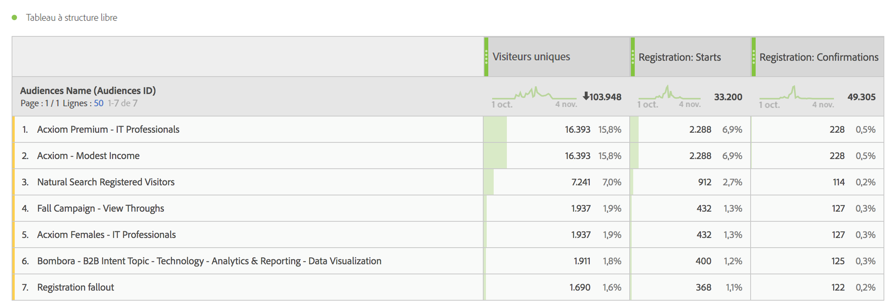
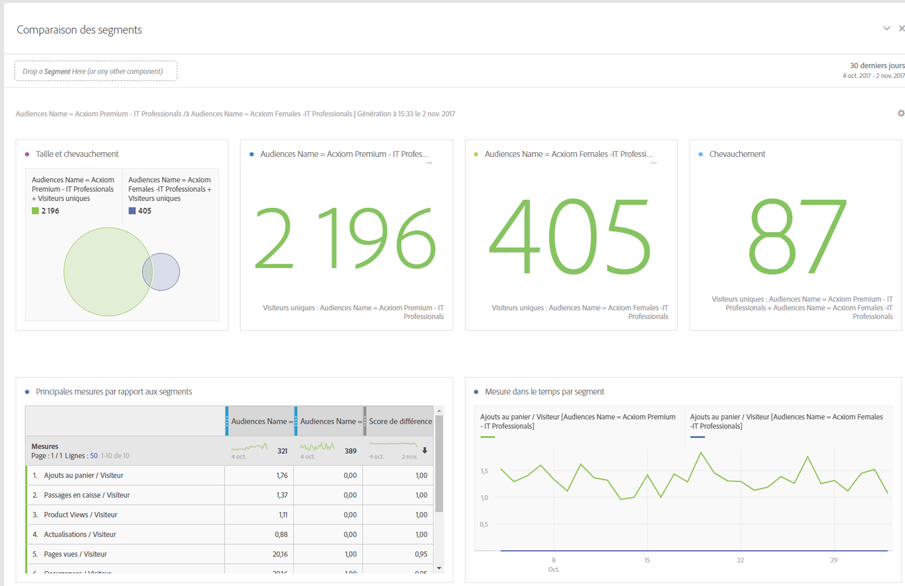
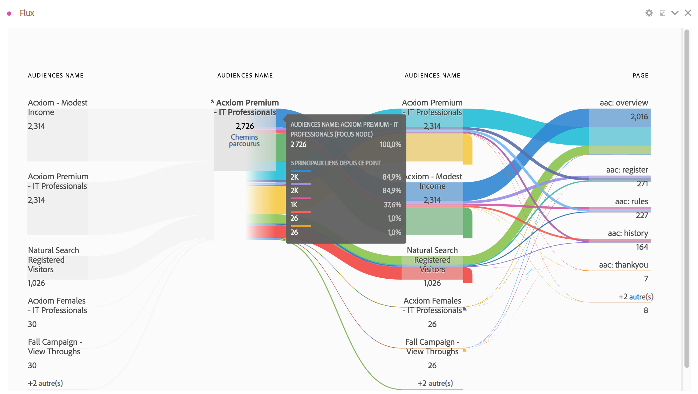
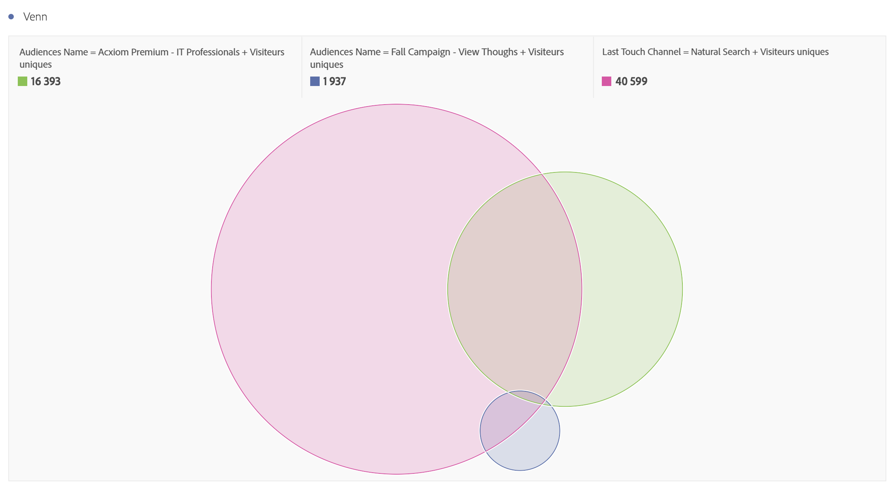
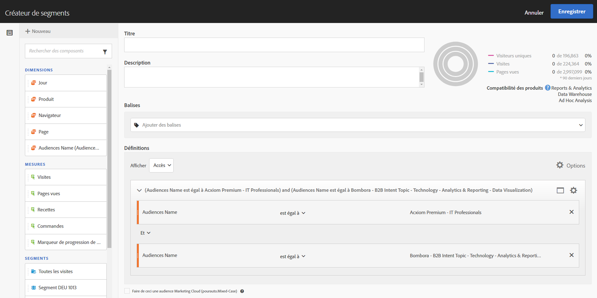

# Utilisation des données d’audience dans Analytics

Vous pouvez utiliser les dimensions Audience Adobe Audience Manager dans Analytics. Les segments intégrés sont de nouvelles dimensions Analytics appelées Identifiant des audiences et Nom des audiences. Ils peuvent être utilisés comme toute autre dimension collectée par Analytics. Dans les flux de données, les ID d’audience sont stockés dans la colonne « mc_audiences ». Ces dimensions ne sont actuellement pas disponibles dans Data Workbench ou Livestream. Voici quelques exemples de la manière dont les dimensions Audiences peuvent être exploitées :

## Analysis Workspace {#workspace}

Dans Analysis Workspace, les segments Adobe Audience Manager apparaissent sous la forme de deux dimensions.

1. Accédez à **[!UICONTROL Workspace]**.
1. Dans la liste **[!UICONTROL Dimensions]**, sélectionnez les dimensions **[!UICONTROL Identifiant de l’audience]** ou **[!UICONTROL Nom de l’audience]**. Le nom est une classification conviviale de l’identifiant.

   

## Comparaison des segments {#compare}

[Comparaison des segments](/help/analyze/analysis-workspace/c-panels/c-segment-comparison/segment-comparison.md) détecte les différences les plus importantes sur le plan statistique entre deux segments. Les données d’audience peuvent être utilisées dans Comparaison des segments de deux façons : 1) sous la forme des 2 segments comparés et 2) sous la forme des éléments du tableau « Principaux éléments de dimension ».

1. Accédez à **[!UICONTROL Workspace]** et sélectionnez le panneau **[!UICONTROL Comparaison des segments]** dans le rail de gauche.

1. Recherchez [!UICONTROL  Nom de l’audience] dans le menu **[!UICONTROL Composant]**.

1. Ouvrez [!UICONTROL Nom d’audience] pour faire apparaître les éléments de dimension associés.
1. Faites glisser les audiences à comparer dans le créateur Comparaison des segments.
1. (Facultatif) : vous pouvez également importer d’autres éléments ou segments de dimension. Deux éléments au maximum peuvent être comparés.
1. Cliquez sur **[!UICONTROL Créer]**.

   Les dimensions ID et Nom d’audience apparaîtront automatiquement dans le tableau « Principaux éléments de dimension » car il s’agit de données de profil supplémentaires pour les deux segments comparés.

   

## Parcours client (flux) dans Analysis Workspace {#flow}

Les données de segment Adobe Audience Manager sont transmises à Analytics sur une base d’accès par accès et représentent l’appartenance à l’audience d’un visiteur à ce moment-là. Cela signifie qu’un visiteur peut appartenir à un segment (p. ex. « Sensibilisation »), puis répondre aux conditions d’un segment plus qualifié ultérieurement (p. ex. « Considération »). Vous pouvez utiliser [Flux](/help/analyze/analysis-workspace/visualizations/fallout/fallout-flow.md) dans Analysis Workspace pour visualiser le parcours d’un visiteur entre les audiences.

1. Accédez à **[!UICONTROL Workspace]** et sélectionnez la visualisation **[!UICONTROL Flux]** dans le rail de gauche.

1. Faites glisser la dimension [!UICONTROL Nom de l’audience] dans le créateur de flux.
1. Cliquez sur **[!UICONTROL Créer]**.
1. (Facultatif) : Faites glisser les dimensions de votre choix dans la visualisation Flux pour créer un [Flux interdimensionnel](/help/analyze/analysis-workspace/visualizations/c-flow/multi-dimensional-flow.md).

Les audiences peuvent également être utilisées dans les [Visualisations des abandons](/help/analyze/analysis-workspace/visualizations/fallout/fallout-flow.md).

## Visualisation de Venn dans Analysis Workspace {#venn}

[Visualisations de Venn](/help/analyze/analysis-workspace/visualizations/venn.md) montrent le chevauchement entre jusqu’à 3 segments.

1. Accédez à **[!UICONTROL Workspace]** et sélectionnez la visualisation de **[!UICONTROL Venn]** dans le rail de gauche.

1. Recherchez [!UICONTROL Nom de l’audience] dans le menu du composant.
1. Ouvrez [!UICONTROL Nom de l’audience] afin que les éléments de dimension associés apparaissent.
1. Faites glisser les audiences que vous souhaitez comparer dans le créateur de Venn.
1. (Facultatif) : vous pouvez également importer d’autres éléments ou segments de dimension ; jusqu’à 3 peuvent être comparés.
1. Cliquez sur **[!UICONTROL Créer]**.

## Créateur de segments {#builder}

Vous pouvez importer les dimensions d’audience dans le [Créateur de segments](/help/components/segmentation/segmentation-workflow/seg-build.md) Analytics, ainsi que les informations de comportement collectées par Analytics.

1. Accédez à **[!UICONTROL Composants]** > **[!UICONTROL Segments]**.
1. Cliquez sur **[!UICONTROL Ajouter]** pour définir un nouveau segment.
1. Après avoir nommé le segment, faites glisser la dimension [!UICONTROL Nom de l’audience] dans le panneau Définitions.
1. (Facultatif) : ajoutez d’autres critères au segment.
1. Enregistrez le segment.

   

