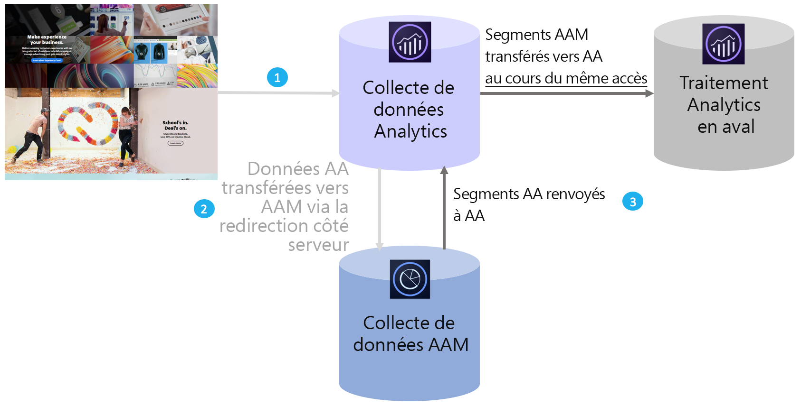

# Audience Analytics - Aperçu

Adobe Audience Manager (AAM) est une puissante plateforme de gestion de données qui permet de créer des profils d’audience uniques à partir d’intégrations de données de première partie, deuxième partie/partenaire et tierce partie. Ces profils d’audience permettent aux annonceurs de définir les segments à plus forte valeur dans n’importe quel canal numérique.

L’intégration d’Audience Analytics permet d’importer des données d’audience d’AAM telles que des données démographiques (p. ex. le sexe ou le niveau de revenu), des informations psychographiques (p. ex. les intérêts et loisirs), des données de gestion de la relation client et des données d’impression de publicités dans n’importe quel processus Analytics.

## Avantages clés {#section_94816D17283349E0BA28521BE55BB868}

L’intégration d’Audience Analytics offre les avantages clés suivants :

* Il s’agit de la première intégration productisée entre une plateforme de gestion des données et un moteur d’analyse disponible sur le marché.
* Les segments sont partagés entre AAM et Analytics en temps réel afin d’informer la découverte d’audiences, la segmentation et l’optimisation.
* Tous les segments AAM sont partagés par défaut, enrichissant ainsi considérablement les profils clients dans Analytics.
* Les administrateurs de solution peuvent activer l’intégration dans l’interface utilisateur en effectuant des modifications de code minimales.
* Seuls les segments conformes aux contrôles des exportations de données d’Audience Manager sont partagés.

## Fonctionnement {#section_CECDF5A0FEC64264B206EFEF54F19EF2}

1. Chaque fois qu’un utilisateur se rend sur vos propriétés numériques, les accès sont collectés et envoyés à Analytics.
1. Avec  [la redirection côté serveur](/help/admin/admin/c-server-side-forwarding/ssf.md), chaque accès enregistré par Analytics est automatiquement envoyé à AAM en temps réel.
1. Grâce à l’intégration d’Audience Analytics, pour chaque accès, l’appartenance d’audience du visiteur est recherchée dans AAM et une liste d’ID de segments est renvoyée à Analytics pour un traitement en temps réel.

Comme les segments AAM sont insérés sur la base d’accès identiques, vous pouvez être assuré que quelles que soient les données disponibles sur un visiteur dans AAM, celles-ci seront prises en compte et tenues à jour pour l’accès concerné. Cette fonctionnalité est supérieure à un module d’extension AppMeasurement dans la mesure où un module externe rend ces segments disponibles uniquement lors de l’accès suivant (et non l’accès actuel).

En outre, nous classifions automatiquement les ID des segments AAM suivant leurs noms conviviaux pour vous éviter d’avoir à rechercher des ID alphanumériques dans les rapports Analytics.

## Conditions préalables {#section_A345DC31F7D44EAE9DC1AB53E824C0CC}

Assurez-vous que les conditions préalables suivantes sont réunies :

* Vous êtes à la fois client d’Audience Manager et d’Adobe Analytics.
* Vous êtes un administrateur d’Audience Manager.
* Vous utilisez Identity Service version 1.5 ou ultérieure.
* Les suites de rapports AAM et Adobe Analytics sont [mappées sur la même organisation Experience Cloud](https://marketing.adobe.com/resources/help/fr_FR/mcloud/report-suite-mapping.html).
* Vous utilisez la [redirection côté serveur](/help/admin/admin/c-server-side-forwarding/ssf.md) et avez mis en œuvre le [module de gestion de l’audience](https://docs.adobe.com/content/help/fr-FR/audience-manager/user-guide/implementation-integration-guides/integration-other-solutions/audience-management-module.html) (pas de code DIL) - AppMeasurement 1.5 ou une version ultérieure.

Ces conditions préalables sont décrites dans le [Workflow Audience Analytics](/help/integrate/c-audience-analytics/c-workflow/audiences-workflow.md).
