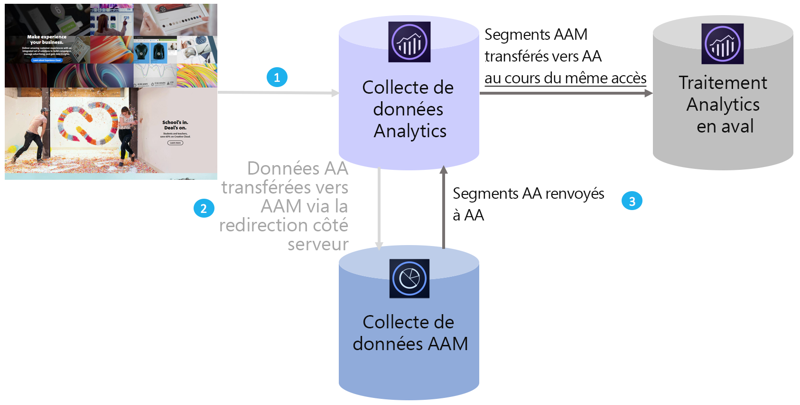

# Audience Analytics - Aperçu

Adobe Audience Manager (Adobe Audience Manager) est une puissante plateforme de gestion des données qui vous permet de créer des profils d’audience uniques à partir d’intégrations de données propriétaires, secondaires/partenaires et tierces. Ces profils d’audience permettent aux annonceurs de définir les segments à plus forte valeur dans n’importe quel canal numérique.

Une fois l’intégration d’Audience Analytics en place, vous pouvez intégrer à n’importe quel workflow Analytics des données d’audience Adobe Audience Manager telles que des informations démographiques (par exemple, le genre ou le niveau de revenu), des informations psychographiques (par exemple, les intérêts et les passe-temps), des données de gestion de la relation client et des données sur les impressions publicitaires.

>[!BEGINSHADEBOX]

Voir  [Audience Analytics](https://experienceleague.adobe.com/en/docs/analytics-learn/tutorials/integrations/audience-manager/audience-analytics-integrate-aam-segments-into-analytics){target="_blank"} pour une vidéo de démonstration.

>[!ENDSHADEBOX]

## Avantages clés {#benefits}

L’intégration d’Audience Analytics offre les avantages clés suivants :

* Il s’agit de la première intégration productisée entre une plateforme de gestion des données et un moteur d’analyse disponible sur le marché.
* Les segments sont partagés de Adobe Audience Manager vers Analytics en temps réel, afin d’informer la découverte, la segmentation et l’optimisation des audiences.
* Tous les segments Adobe Audience Manager sont partagés par défaut, ce qui enrichit entièrement les profils clients dans Analytics.
* Les administrateurs de solution peuvent activer l’intégration dans l’interface utilisateur en effectuant des modifications de code minimales.
* Seuls les segments conformes aux contrôles des exportations de données d’Audience Manager sont partagés.

## Fonctionnement d’Audience Analytics {#works}

1. Chaque fois qu’un utilisateur se rend sur vos propriétés numériques, les accès sont collectés et envoyés à Analytics.
1. Grâce au [transfert côté serveur](/help/admin/tools/manage-rs/edit-settings/general/c-server-side-forwarding/ssf.md), chaque accès enregistré par Analytics est automatiquement envoyé à Adobe Audience Manager en temps réel.
1. Grâce à l’intégration d’Audience Analytics, pour chaque accès, l’appartenance à l’audience d’un visiteur est recherchée dans Adobe Audience Manager et une liste d’identifiants de segment est renvoyée à Analytics pour traitement en temps réel.

Comme les segments Adobe Audience Manager sont insérés sur la base du même accès, vous pouvez être sûr que toutes les données disponibles dans Adobe Audience Manager sur un visiteur ne seront pas manquantes et mises à jour pour cet accès. Cette fonctionnalité est supérieure à un module d’extension AppMeasurement dans la mesure où un module externe rend ces segments disponibles uniquement lors de l’accès suivant (et non l’accès actuel).

En outre, nous classons automatiquement les identifiants de segment Adobe Audience Manager en fonction de leurs noms conviviaux, de sorte que vous n’ayez pas à consulter d’identifiants alphanumériques dans les rapports Analytics.

## Conditions préalables {#prerequisites}

Assurez-vous que les conditions préalables suivantes sont réunies :

* Vous êtes à la fois client d’Audience Manager et d’Adobe Analytics.
* Vous êtes un administrateur d’Audience Manager.
* Vous utilisez Identity Service version 1.5 ou ultérieure.
* Les suites de rapports Adobe Audience Manager et Adobe Analytics sont mappées à la même organisation CX Enterprise.
* Vous utilisez la [redirection côté serveur](/help/admin/tools/manage-rs/edit-settings/general/c-server-side-forwarding/ssf.md) et avez mis en œuvre le [module de gestion de l’audience](https://experienceleague.adobe.com/docs/audience-manager/user-guide/implementation-integration-guides/integration-other-solutions/audience-management-module.html?lang=fr) (pas de code DIL) - AppMeasurement 1.5 ou une version ultérieure.

Ces conditions préalables sont décrites dans le [Workflow Audience Analytics](/help/integrate/c-audience-analytics/c-workflow/audiences-workflow.md).
