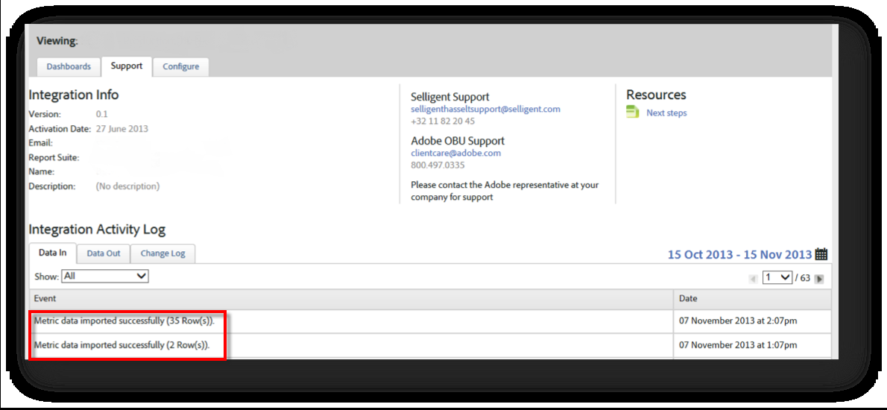

# Verifying the Integration{#verifying-the-integration}

Une fois toutes les étapes de déploiement terminées, vous pouvez vérifier que l'intégration transfère correctement les données.

Le démarrage de l'échange de données prendra quelques jours. Veuillez contacter Selligent après avoir activé l'intégration.

## Journal d’activité d’intégration {#section-927e270495db479fba9578915d9ae9c9}

Accédez à votre intégration Selligent dans Connecteurs de données. Under the **[!UICONTROL Support]** tab, you should see events like Metric Data imported and/or Classification Data imported successfully :

## Reporting Data {#section-ebd481a162324e66bd6dc8cb4b8d2424}

Affichez vos rapports Messages Selligent avec les mesures appropriées.

1. Accédez à Rapports et analyses sous Adobe Marketing Cloud.
1. Sélectionnez la suite de rapports appropriée.
1. Under **[!UICONTROL Custom Conversion]**, select the **[!UICONTROL Message ID Reports]** and choose **[!UICONTROL Message ID/Message Name]**.

