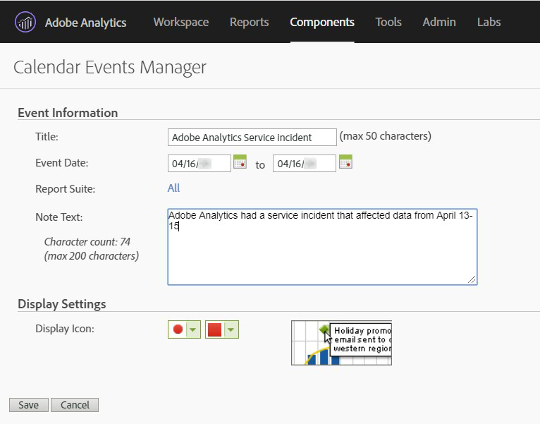

# Analyser les données affectées par les 

Il arrive qu’un ait un impact sur la qualité des données de votre entreprise. Par exemple :

* Un robot qui envoie des données plus anciennes, telles que des millions de dollars de recettes
* Votre entreprise a envoyé une mise à jour de votre site Web qui a eu un impact négatif sur votre implémentation Analytics.
* Autres problèmes affectant la qualité ou l’exhaustivité des données

Si votre site a rencontré des problèmes de qualité des données, de mise en oeuvre ou d’autres lacunes dans les données, vous pouvez l’exclure du afin d’éviter de prendre des décisions sur des données partielles. Utilisez ces sections pour évaluer l’impact du sur vos données et déterminer comment vous souhaitez procéder.

## Analyser et exclure des données à l’aide de la segmentation

Adobe Analytics  un moyen simple et robuste de se concentrer sur ou d’exclure des données à l’aide de la segmentation. Vous pouvez utiliser les dimensions de plage de dates dans les segments pour filtrer ou vous concentrer sur ces dates spécifiques. Voir [Exclure des dates spécifiques dans ](/help/components/c-segmentation/use-cases/exclude-date-range.md) dans le guide de l’utilisateur Composants.

## Comparaison d’un  avec des plages de dates précédentes

Si vous souhaitez en savoir plus sur l’impact d’un sur vos données au fil du temps, vous pouvez utiliser la comparaison de dates dans  Workspace. Cette fonctionnalité vous permet de comparer les données jour par jour, semaine par semaine ou mois par mois pour comparer les plages précédentes. Vous pouvez ensuite utiliser cette comparaison pour déterminer l’impact d’un  sur les tendances. Voir [Comparaison des dates affectées par un aux plages](/help/analyze/analysis-workspace/components/calendar-date-ranges/compare-event.md) précédentes dans le guide de l’utilisateur Analyser.

## Utilisation d’un de calendrier dans les rapports et analyses

Si vous utilisez les rapports et analyses, vous pouvez utiliser un de [calendrier](/help/components/t-calendar-event.md) pour mettre en évidence les jours affectés dans n’importe quel rapport de tendances. Cette méthode ne s’applique pas à   Workspace.

1. Accédez à **[!UICONTROL Components]** > **[!UICONTROL Calendar events]**.
2. Entrez le titre, la plage de dates et le texte de la note de votre choix.
3. Cliquez sur **[!UICONTROL Save]**.

