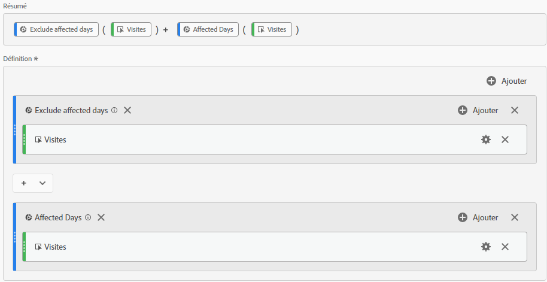
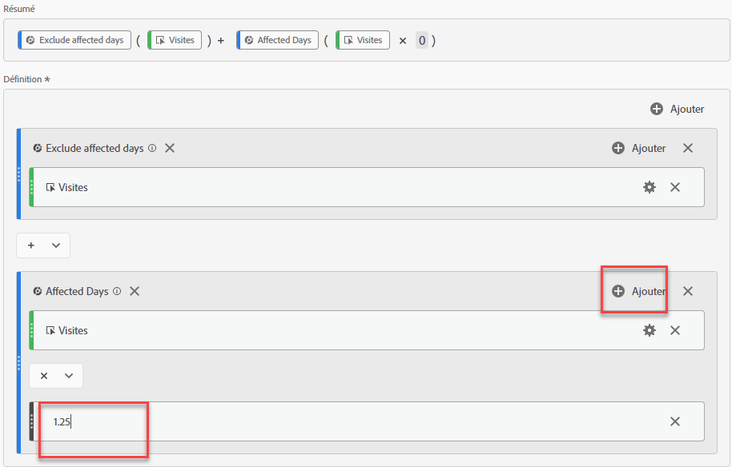
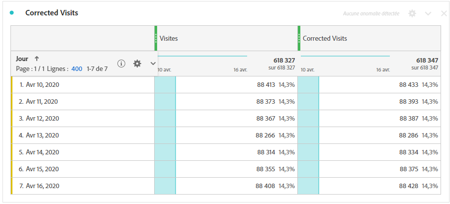
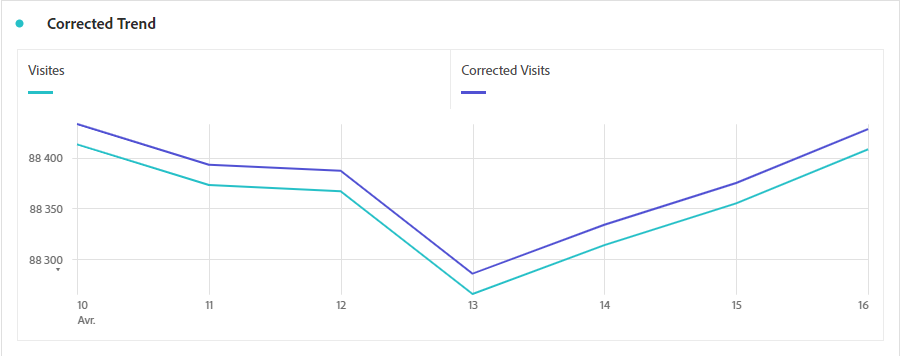

# Dérivation de données affectées par les événements

Si vous disposez de données [impact d’un événement](overview.md), vous pouvez utiliser des mesures calculées pour dériver des valeurs estimées pour la durée de l’événement. Si, par exemple, un événement a entraîné une baisse de 25 % des données, vous pouvez l’utiliser comme multiplicateur dans une mesure calculée.

Ces étapes fonctionnent mieux lorsque vous comprenez l’impact d’un événement, tant du point de vue de la segmentation que de la comparaison des dates. Veillez à suivre [Comparaison des dates affectées par un événement avec les périodes précédentes](compare-dates.md) et [Exclusion de dates spécifiques dans l’analyse](segments.md) avant de suivre cette page.

>[!NOTE]
>
>Cette approche est une estimation basée sur un ensemble spécifique d’entrées et de périodes. Il ne s’agira pas d’une solution complète pour tous les cas d’utilisation ou tranches de données. En outre, cette approche nécessite que la période affectée comporte au moins 1 accès pour le calcul.

Pour créer une mesure calculée estimée pour la période affectée :

1. Créez deux segments pour &quot;Jours affectés&quot; et &quot;Exclure les jours affectés&quot;, comme indiqué dans la section [Exclusion de dates spécifiques dans l’analyse](segments.md).
2. Accédez à **[!UICONTROL Composants]** > **[!UICONTROL Mesures calculées]**.
3. Cliquez sur **[!UICONTROL Ajouter]**.
4. Faites glisser les deux segments ci-dessus vers le canevas de définition. Remplacez l’opérateur entre eux par un `+` pour les résumer.
5. Ajoutez la mesure souhaitée dans les deux segments. Par exemple, vous pouvez utiliser la mesure &quot;Visites&quot;.

   

6. Cliquez sur **[!UICONTROL Ajouter]** dans le coin supérieur droit du conteneur &quot;jours concernés&quot;, puis cliquez sur **[!UICONTROL Nombre statique]**. Définissez le nombre statique sur le pourcentage que vous souhaitez décaler vos données, comme indiqué sous [Comparaison des dates affectées par un événement avec les périodes précédentes](compare-dates.md). Dans cet exemple, le décalage est de 25 %, soit 1,25.

   

7. Appliquez la mesure &quot;corrigée&quot; côte à côte dans un tableau à structure libre de tendance. Tous les jours en dehors de l’événement reflètent leur nombre de mesures normal, tandis que tous les jours affectés utilisent le décalage du multiplicateur.

   

8. Affichez les données dans une visualisation en ligne pour voir l’effet de la mesure corrigée.

   
