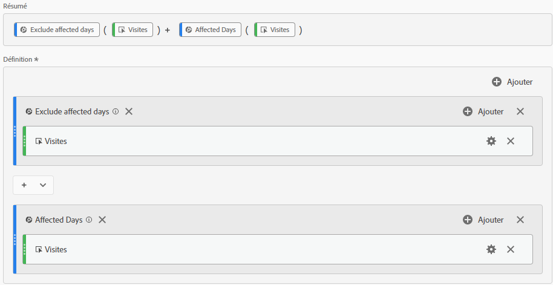
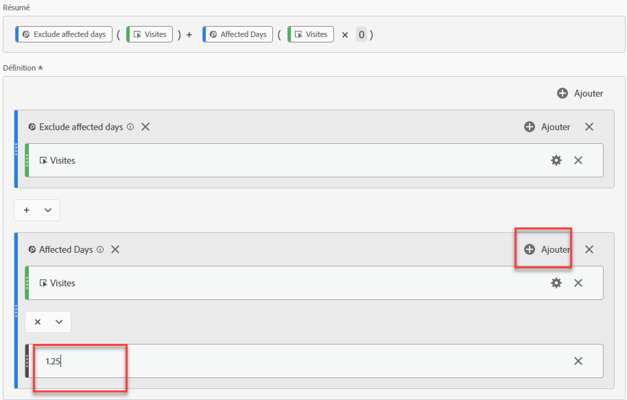
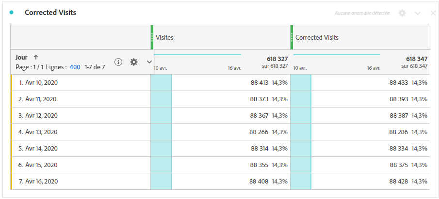
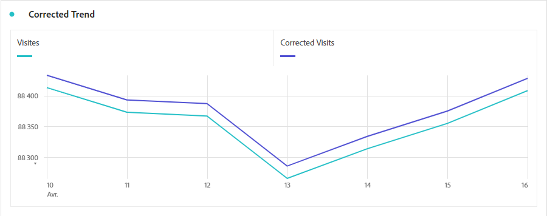

# Dérivation de données affectées par les événements

Si des données [affectées par un événement](overview.md) sont disponibles, vous pouvez utiliser des mesures calculées afin d’obtenir des valeurs estimées pour la durée de l’événement. Par exemple, si un événement a provoqué une baisse de 25 % des données, vous pouvez l’utiliser comme multiplicateur dans une mesure calculée.

Ces étapes fonctionnent mieux lorsque vous comprenez l’impact d’un événement, tant du point de vue de la segmentation que de la comparaison de dates. Veillez à suivre les instructions suivantes [Comparer les dates affectées par un événement aux plages précédentes](compare-dates.md) et [Exclure des dates spécifiques dans l’analyse](segments.md) avant de suivre cette page.

>[!NOTE]
>
>Cette approche est une estimation basée sur un ensemble spécifique d’entrées et de périodes. Il ne s’agira pas d’une solution complète pour tous les cas d’utilisation ou tranches de données. En outre, cette approche nécessite que la période affectée ait au moins 1 accès à partir duquel effectuer le calcul.

Pour créer une mesure calculée estimée pour la période concernée :

1. Créez deux segments pour « Jours affectés » et « Exclure les jours affectés », comme indiqué sous [Exclure des dates spécifiques dans l’analyse](segments.md).
2. Accédez à **[!UICONTROL Composants]** > **[!UICONTROL Mesures calculées]**.
3. Cliquez sur **[!UICONTROL Ajouter]**.
4. Faites glisser les deux segments ci-dessus vers la zone de travail de définition. Remplacez l’opérateur entre eux par un `+` pour les additionner.
5. Ajoutez la mesure souhaitée dans les deux segments. Par exemple, vous pouvez utiliser la mesure « Visites ».

   

6. Cliquez sur **[!UICONTROL Ajouter]** en haut à droite du conteneur « Jours concernés », puis sur **[!UICONTROL Nombre statique]**. Définissez le nombre statique sur le pourcentage de décalage de vos données, comme indiqué sous [Comparer les dates affectées par un événement aux plages précédentes](compare-dates.md). Dans cet exemple, le décalage est de 25 %, soit 1,25.

   

7. Application côte à côte de la mesure « corrigée » dans un tableau à structure libre à tendance. Tous les jours en dehors de l’événement reflètent leur nombre de mesures normal, tandis que tous les jours affectés utilisent le décalage multiplicateur.

   

8. Affichez les données dans une visualisation en ligne pour voir l’effet de la mesure corrigée.

   
