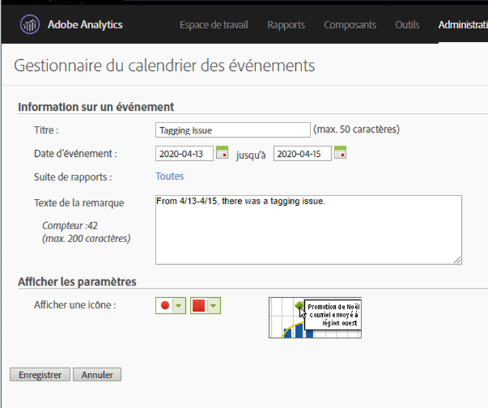

# Communiquer l&#39;impact du événement aux utilisateurs

Si des données [sont affectées par un événement](overview.md), il est important de communiquer ce événement aux utilisateurs de votre organisation.

* Développer une clause exonératoire de responsabilité commune que vous pouvez utiliser dans les communications pour assurer la cohérence
* Communiquer en permanence avec les utilisateurs d’Analytics et les principales parties prenantes pendant et après le événement
* Placez un rappel de calendrier pour les jalons suivants, tels que le mois ou l’année suivant. Cette communication permet à l’avenir de rappeler aux utilisateurs qui consultent les rapports l’impact des rapports mensuels ou annuels.

Dans Adobe Analytics, les sections suivantes présentent différentes manières de communiquer avec les utilisateurs de votre entreprise. Vous pouvez également utiliser d’autres méthodes en dehors de l’Adobe Analytics, telles que le courriel, pour communiquer avec les utilisateurs.

## Communiquer par le biais de descriptions de panneau ou de visualisation

Si un projet Workspace est partagé par des utilisateurs de votre entreprise, vous pouvez communiquer l’impact d’un événement au moyen de descriptions de panneau ou de visualisation. Cliquez avec le bouton droit sur un panneau ou un en-tête de visualisation, puis sélectionnez **[!UICONTROL Modifier la description]**.

## Communiquer au moyen de visualisations textuelles

Vous pouvez également communiquer l’impact d’un événement au moyen de visualisations textuelles dédiées. Voir [Visualisations textuelles](/help/analyze/analysis-workspace/visualizations/text.md) dans le guide de l’utilisateur Analyser.

## Ajouter des événements de calendrier personnalisés aux tendances dans Workspace

Pour toute visualisation de tendance dans Workspace, vous pouvez ajouter une série qui représente la plage de dates affectée.

1. Créez une mesure calculée avec le segment &quot;Jours affectés&quot; en suivant [Exclure des dates spécifiques dans analyse](segments.md).
1. Ajoutez la mesure de votre choix sur le canevas de mesures calculées.

   

1. Ajoutez un titre et une description informant les utilisateurs de l’impact. Vous pouvez également baliser cette mesure en tant qu’annotation de calendrier, si vous le souhaitez.

   

1. Dans un tableau à structure libre, ajoutez la dimension &quot;Jour&quot;. Ajoutez &quot;Visites&quot; et votre mesure calculée sous forme de colonnes côte à côte.

   

1. Cliquez sur l’icône d’engrenage des paramètres de colonne pour votre mesure calculée et activez **[!UICONTROL Interpréter zéro comme aucune valeur]**.

   

1. Ajoutez une visualisation en ligne. Les jours affectés sont représentés avec une couleur différente. Pour plus d’informations, les utilisateurs peuvent également cliquer sur l’icône &quot;Infos&quot; dans la mesure calculée.

   

## Utilisation d’un événement de calendrier dans les rapports et analyses

Si vous utilisez les rapports et analyses, vous pouvez utiliser un [événement de calendrier](/help/components/t-calendar-event.md) pour mettre en évidence les jours affectés dans tout rapport de tendances. Cette méthode ne s’applique pas à Analysis Workspace.

1. Accédez à **[!UICONTROL Composants]** > **[!UICONTROL événements calendrier]**.
2. Entrez le titre, la plage de dates et le texte de la note de votre choix.
3. Cliquez sur **[!UICONTROL Enregistrer]**.

