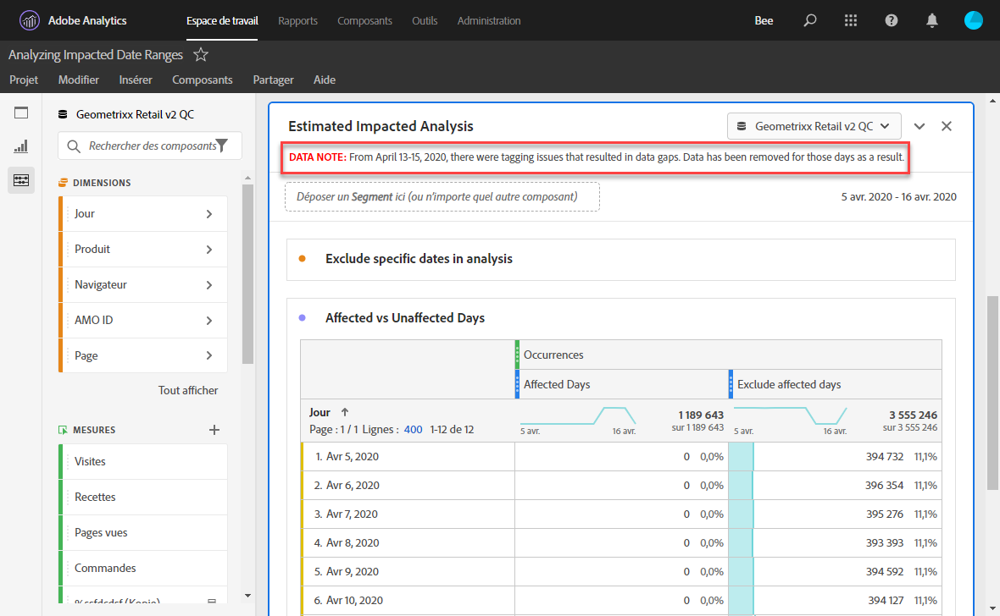
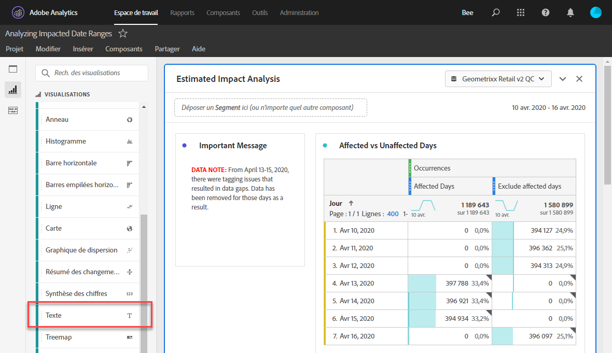
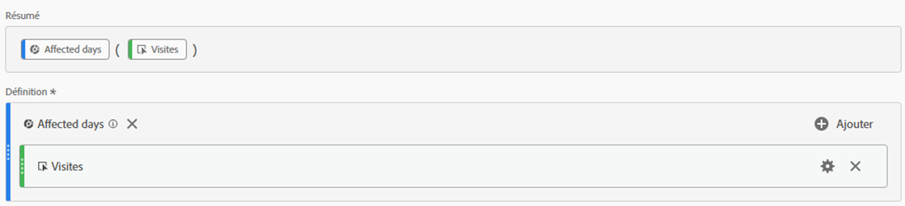
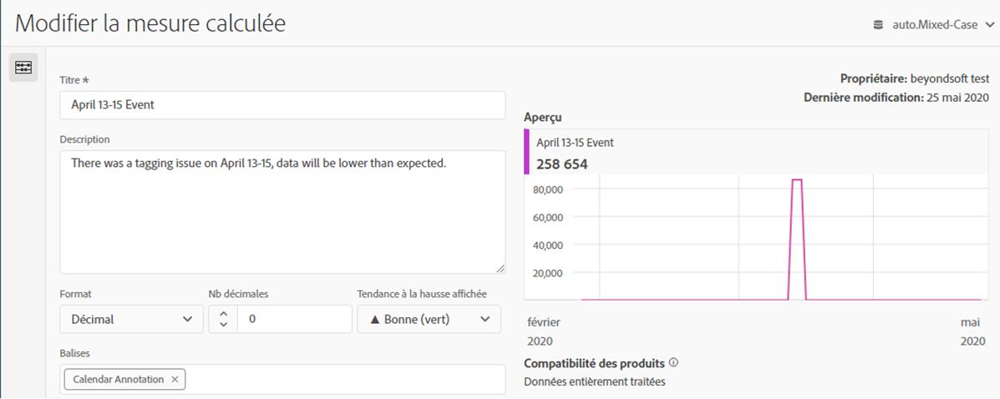
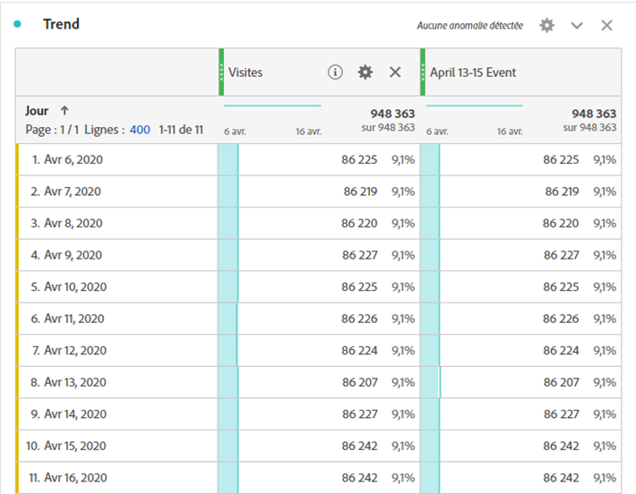
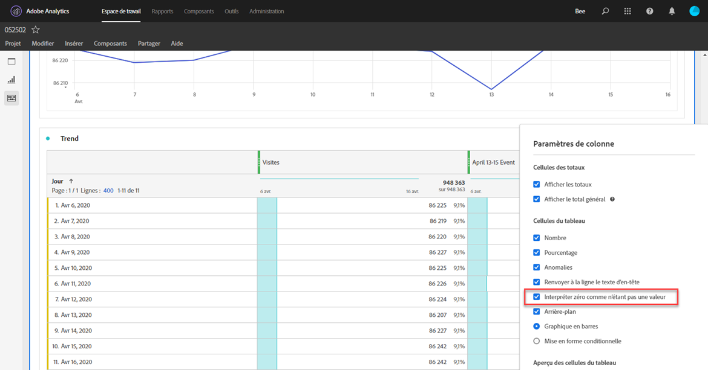
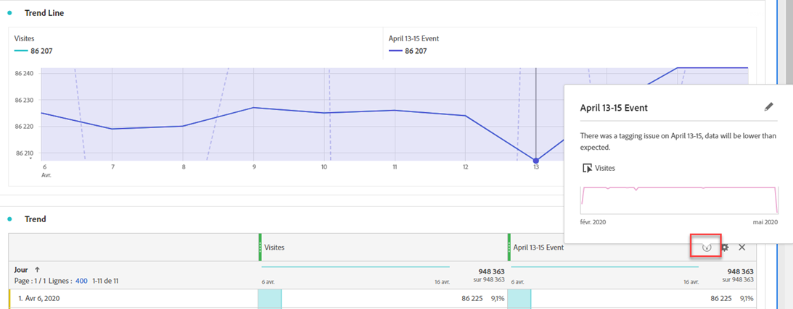

# Communication de l’impact d’un événement aux utilisateurs

Si des données [ sont affectées par un événement](overview.md), il est important de communiquer cet événement aux utilisateurs de votre entreprise.

* Développer une clause de non-responsabilité courante que vous pouvez utiliser dans les communications pour assurer la cohérence
* Fournir une communication permanente aux utilisateurs d’Analytics et aux principaux intervenants pendant et après l’événement
* Placez un rappel de calendrier pour les jalons suivants, tels que le mois ou l’année suivant. Cette communication permet à l’avenir de rappeler aux utilisateurs qui visualisent des rapports l’impact dans les rapports d’un mois à l’autre ou d’une année à l’autre.

Dans Adobe Analytics, les sections suivantes présentent différentes manières de communiquer avec les utilisateurs de votre entreprise. Vous pouvez également utiliser d’autres méthodes en dehors d’Adobe Analytics, telles que le courrier électronique, pour communiquer avec les utilisateurs.

## Communication par le biais des descriptions de panneau ou de visualisation

Si un projet Workspace est partagé par les utilisateurs de votre entreprise, vous pouvez communiquer l’impact d’un événement au moyen de descriptions de panneau ou de visualisation. Cliquez avec le bouton droit sur un panneau ou un en-tête de visualisation, puis sélectionnez **[!UICONTROL Modifier la description]**.

## Communication au moyen de visualisations textuelles

Vous pouvez également communiquer l’impact d’un événement au moyen de visualisations textuelles dédiées. Voir [Visualisations de texte](/help/analyze/analysis-workspace/visualizations/text.md) dans le guide d’utilisation Analyser.

## Ajout d’événements de calendrier personnalisés aux tendances dans Workspace

Pour toute visualisation avec tendance dans Workspace, vous pouvez ajouter une série qui représente la période affectée.

1. Créez une mesure calculée avec le segment &quot;Jours affectés&quot; en suivant [Exclure des dates spécifiques dans l’analyse](segments.md).
1. Ajoutez la mesure souhaitée au canevas de mesure calculée.

   

1. Ajoutez un titre et une description informant les utilisateurs de l’impact. Vous pouvez également baliser cette mesure en tant qu’annotation de calendrier, le cas échéant.

   

1. Dans un tableau à structure libre, ajoutez la dimension &quot;Jour&quot;. Ajoutez &quot;Visites&quot; et votre mesure calculée sous forme de colonnes côte à côte.

   

1. Cliquez sur l’icône d’engrenage des paramètres de colonne pour votre mesure calculée et activez l’option **[!UICONTROL Interpréter zéro comme n’étant pas une valeur]**.

   

1. Ajoutez une visualisation Ligne . Les jours concernés sont représentés avec une couleur différente. Pour plus d’informations, les utilisateurs peuvent également cliquer sur l’icône &quot;Infos&quot; dans la mesure calculée.

   

