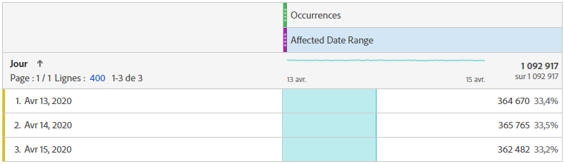
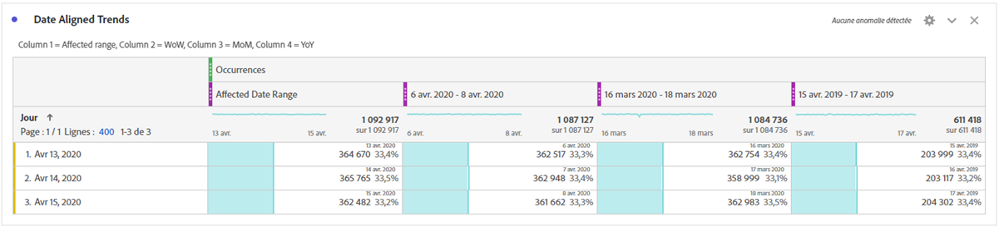
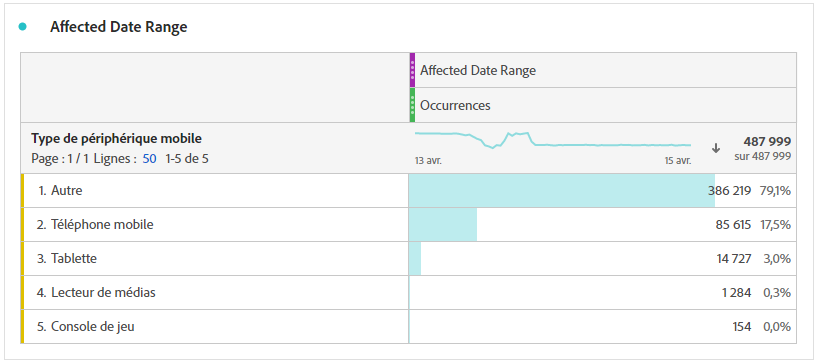
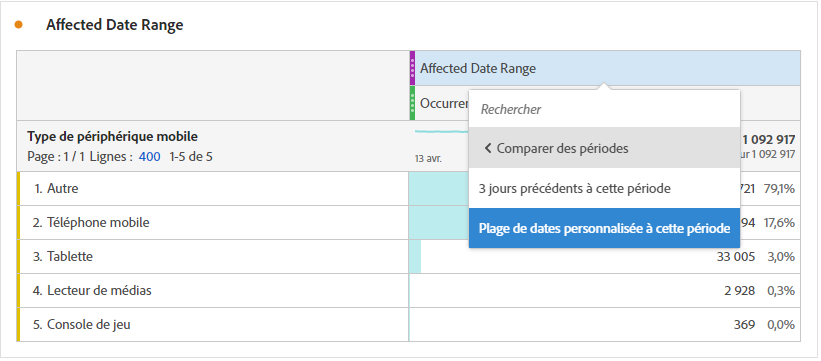
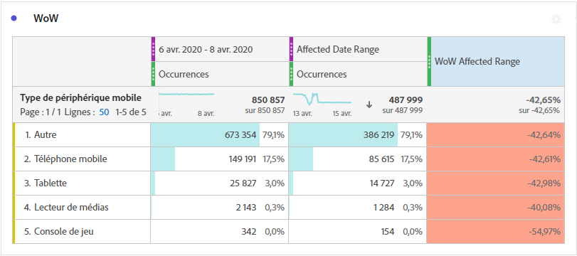
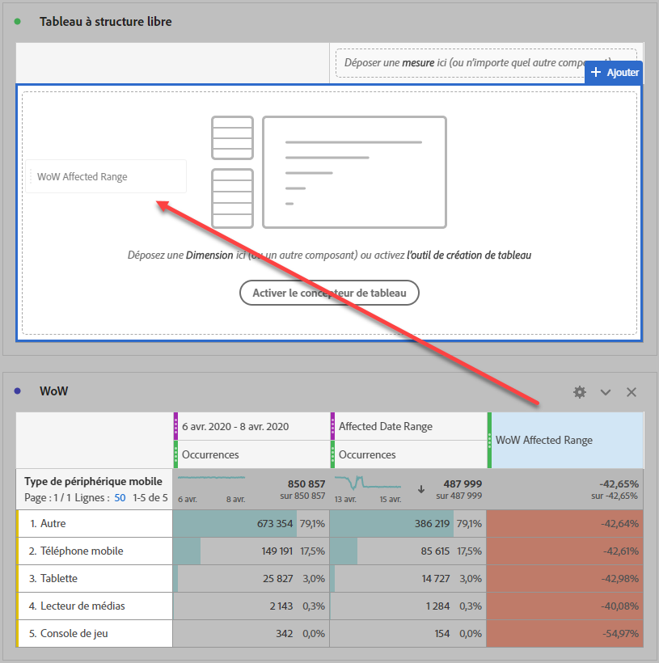
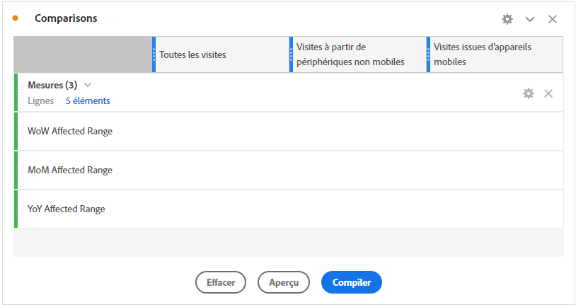
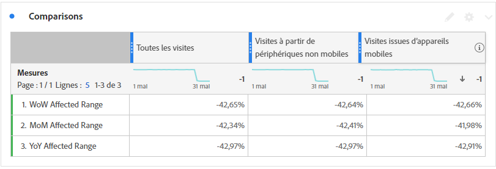

# Comparaison des dates affectées par un événement avec les périodes précédentes

Si vous disposez de données [impact d’un événement](overview.md), vous pouvez consulter les tendances historiques pour en mesurer l’impact. Cette comparaison s’avère utile pour comprendre l’impact d’un événement sur vos données. Vous pouvez donc décider d’exclure les données, d’ajouter une note aux rapports ou de les ignorer.

## Création d’une période qui inclut l’événement

Créez une période qui englobe l’événement pour commencer à explorer l’impact de cet événement.

1. Accédez à **[!UICONTROL Composants]** > **[!UICONTROL Périodes]**.
2. Cliquez sur **[!UICONTROL Ajouter]**.
3. Sélectionnez la période au cours de laquelle l’événement s’est produit. Cliquez sur **[!UICONTROL Enregistrer]**.

   

## Affichage côte à côte des dates d’événement et des plages antérieures similaires

Vous pouvez comparer n’importe quelle mesure entre la période de l’événement et des périodes antérieures similaires à l’aide d’une visualisation de tableau à structure libre.

1. Ouvrez un projet Workspace et ajoutez la dimension &quot;Jour&quot; au tableau à structure libre. Appliquez la période récemment créée empilée sur une mesure, par exemple &quot;Occurrences&quot;.

   

2. Cliquez avec le bouton droit sur la période, puis cliquez sur **[!UICONTROL Ajout d’une colonne de période]** > **[!UICONTROL Période personnalisée jusqu’à cette période]**.
   * Pour une comparaison d’une semaine à l’autre, sélectionnez la période de l’événement moins 7 jours. Assurez-vous que les jours de la semaine entre l’événement et cette période sont alignés.
   * Pour une comparaison d’un mois à l’autre, sélectionnez la période de l’événement du mois dernier. Vous pouvez également sélectionner la plage de l’événement moins 28 jours si vous souhaitez aligner les jours de la semaine.
   * Pour une comparaison d’une année à l’autre, sélectionnez la plage de l’événement de l’année dernière.
3. Lorsque vous sélectionnez la période souhaitée, elle est ajoutée à votre tableau à structure libre. Cliquez avec le bouton droit de la souris et ajoutez autant de plages de dates que vous souhaitez comparer.

   

## Calcul des différences de pourcentage entre l’événement et les périodes antérieures similaires

Comparez des éléments de dimension entre la période d’un événement et des périodes antérieures similaires à l’aide d’une visualisation de tableau à structure libre. Ces étapes illustrent un exemple hebdomadaire que vous pouvez suivre.

1. Ouvrez un projet Workspace et ajoutez une **dimension non temporelle** au tableau à structure libre. Par exemple, vous pouvez utiliser la dimension &quot;Type d’appareil mobile&quot;. Appliquez la période récemment créée empilée sur une mesure, telle que &quot;Occurrences&quot; :

   

2. Cliquez avec le bouton droit sur la période, puis cliquez sur **[!UICONTROL Comparaison de périodes]** > **[!UICONTROL Période personnalisée jusqu’à cette période]**. Sélectionnez la plage de l’événement moins 7 jours. Assurez-vous que les jours de la semaine entre l’événement et cette période sont alignés.

   

3. Renommez la mesure &quot;Pourcentage de changement&quot; qui en résulte en un élément plus spécifique, tel que &quot;La plage affectée par WoW&quot;. Cliquez sur l’icône d’information, puis sur le crayon de modification pour modifier le nom de la mesure.

   

4. Répétez les étapes 3 et 4 pour les comparaisons d’un mois à l’autre et d’une année à l’autre. Vous pouvez effectuer cette action dans le même tableau ou dans des tableaux distincts.

## Analyse côte à côte des plages de dates de comparaison sous la forme de lignes

Si vous souhaitez analyser plus en détail les changements de pourcentage ci-dessus, vous pouvez les convertir en lignes.

1. Ajoutez une visualisation de tableau à structure libre et activez le créateur de tableau. Cette action vous permet de placer les mesures de changement de pourcentage dans l’ordre souhaité.
2. Tiens `Ctrl` (Windows) ou `Cmd` (Mac) et faites glisser les mesures de modification de 3 % sur les lignes du tableau, une par une.

   

3. Ajoutez le segment &quot;Toutes les visites&quot; à la colonne du tableau, ainsi que tous les autres segments souhaités.

   

4. Cliquez sur **[!UICONTROL Créer]**. Dans le tableau qui en résulte, vous pouvez afficher les périodes affectées par rapport à la semaine, au mois et à l’année précédents pour tous les segments de votre choix.

   
