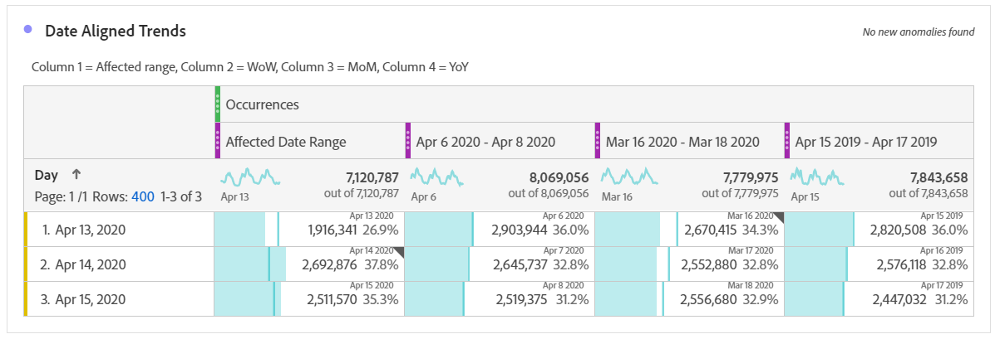
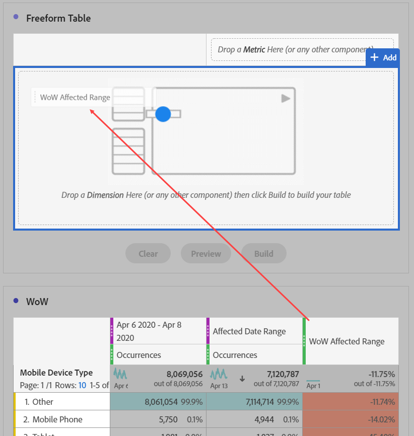

# Comparaison des dates affectées par un événement aux périodes précédentes

Si vous disposez de données [affectées par un événement](overview.md), vous pouvez examiner les tendances historiques pour évaluer leur impact. Cette comparaison est utile pour comprendre l’ampleur de l’impact d’un événement sur vos données. Vous pouvez ainsi décider d’exclure les données, d’ajouter une note aux rapports ou de les ignorer.

## Créer une période qui inclut l’événement

Créez une période qui englobe l’événement pour commencer à explorer l’impact de cet événement.

1. Accédez à **[!UICONTROL Composants]** > **[!UICONTROL Périodes]**.
2. Cliquez sur **[!UICONTROL Ajouter]**.
3. Sélectionnez la période au cours de laquelle l’événement s’est produit. Cliquez sur **[!UICONTROL Enregistrer]**.

   

## Affichage côte à côte des dates d’événement et des périodes précédentes similaires

Vous pouvez comparer n’importe quelle mesure de la période de l’événement à des périodes précédentes similaires à l’aide d’une visualisation de tableau à structure libre.

1. Ouvrez un projet Workspace et ajoutez la dimension « Jour » au tableau à structure libre. Appliquez la période récemment créée empilée sur une mesure, telle que « Occurrences ».

   

2. Cliquez avec le bouton droit sur la période, puis cliquez sur **[!UICONTROL Ajouter une colonne de période]** > **[!UICONTROL Période personnalisée à cette période]**.
   * Pour une comparaison semaine par semaine, sélectionnez l’intervalle de l’événement moins 7 jours. Assurez-vous que les jours de la semaine entre l’événement et cette période sont alignés.
   * Pour une comparaison mois par mois, sélectionnez la plage de l’événement du mois dernier. Vous pouvez également sélectionner la plage de l’événement moins 28 jours si vous souhaitez aligner les jours de la semaine.
   * Pour une comparaison d’une année sur l’autre, sélectionnez la plage de l’événement l’année dernière.
3. Lorsque vous sélectionnez la période souhaitée, elle est ajoutée à votre tableau à structure libre. Vous pouvez effectuer un clic droit et ajouter autant de périodes que vous le souhaitez pour les comparer.

   

## Calculer les différences de pourcentage entre l&#39;événement et des périodes précédentes similaires

Comparez les éléments de dimension entre la période d’un événement et des périodes antérieures similaires à l’aide d’une visualisation de tableau à structure libre. Ces étapes illustrent un exemple que vous pouvez suivre semaine après semaine.

1. Ouvrez un projet Workspace et ajoutez une **dimension non temporelle** au tableau à structure libre. Par exemple, vous pouvez utiliser la dimension « Type d’appareil mobile ». Appliquez la période récemment créée empilée sur une mesure, telle que « Occurrences » :

   

2. Cliquez avec le bouton droit sur la période, puis cliquez sur **[!UICONTROL Comparer des périodes]** > **[!UICONTROL Période personnalisée à cette période]**. Sélectionnez la plage de l’événement moins 7 jours. Assurez-vous que les jours de la semaine entre l’événement et cette période sont alignés.

   

3. Renommez la mesure « Changement en pourcentage » qui en résulte en quelque chose de plus spécifique, tel que « Plage concernée par le workflow ». Cliquez sur l’icône d’informations, puis sur le crayon de modification pour modifier le nom de la mesure.

   

4. Répétez les étapes 3 et 4 pour des comparaisons mois par mois et année par année. Vous pouvez effectuer cette action dans la même table ou dans des tables distinctes.

## Analyse des périodes de comparaison côte à côte sous forme de lignes

Si vous souhaitez analyser plus en détail les modifications de pourcentage ci-dessus, vous pouvez les convertir en lignes.

1. Ajoutez une visualisation de tableau à structure libre et activez le générateur de tableau. Cette action vous permet de placer les mesures de changement en pourcentage dans l’ordre souhaité.
2. Maintenez la touche `Ctrl` (Windows) ou `Cmd` (Mac) enfoncée et faites glisser les mesures de changement de 3 % dans les lignes du tableau, une par une.

   

3. Ajoutez le segment « Toutes les visites » à la colonne du tableau, ainsi que tous les autres segments souhaités.

   

4. Cliquez sur **[!UICONTROL Créer]**. Le tableau qui en résulte vous permet d’afficher les périodes concernées par rapport à la semaine, au mois et à l’année précédents sur tous les segments souhaités.

   
