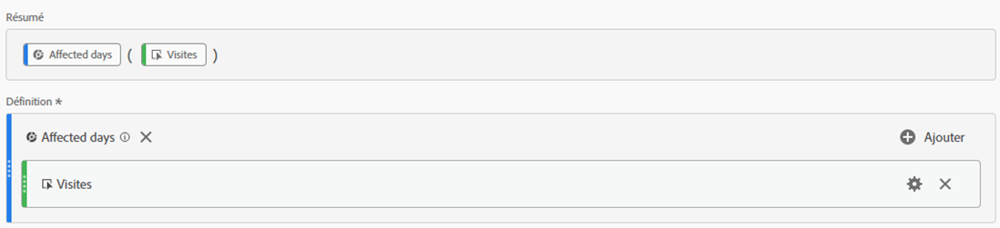
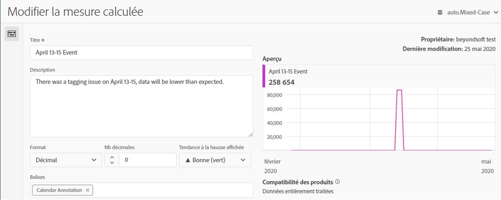
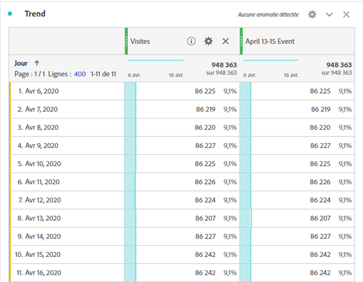
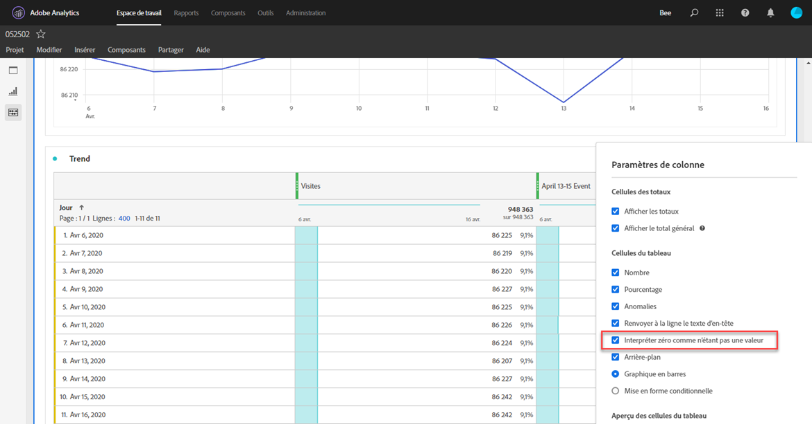
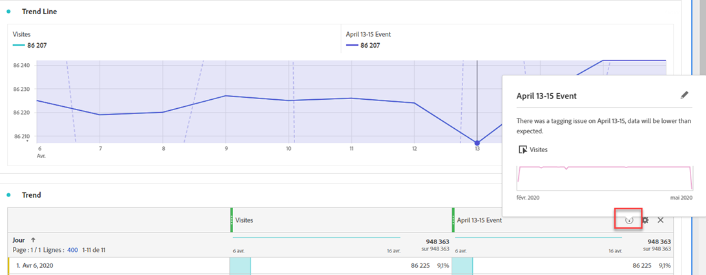

# Communiquer l’impact aux utilisateurs

Si des données sont [affectées par une](../event-impacted.md), il est important de communiquer ce aux utilisateurs de votre organisation.

* Élaborer une clause exonératoire de responsabilité commune que vous pouvez utiliser dans les communications pour assurer la cohérence
* Communiquer en permanence avec les utilisateurs d’Analytics et les principaux intervenants pendant et après la  du
* Placez un rappel de calendrier pour les jalons suivants, tels que le mois ou l’année suivant. Cette communication permet à l’avenir de rappeler aux utilisateurs qui consultent les rapports l’impact des rapports mensuels ou annuels.

Dans Adobe Analytics, les sections suivantes montrent différentes manières de communiquer avec les utilisateurs de votre entreprise. Vous pouvez également utiliser d’autres méthodes en dehors d’Adobe Analytics, telles que le courrier électronique, pour communiquer avec les utilisateurs.

## Communiquer par le biais de descriptions de panneau ou de visualisation

Si un projet Workspace est partagé par des utilisateurs de votre entreprise, vous pouvez communiquer l’impact d’un  par le biais de descriptions de panneau ou de visualisation. Cliquez avec le bouton droit de la souris sur un panneau ou un en-tête de visualisation, puis sélectionnez **[!UICONTROL Edit description]**.

## Communiquer au moyen de visualisations textuelles

Vous pouvez également communiquer l’impact d’un  à l’aide de visualisations textuelles dédiées. See [Text visualizations](/help/analyze/analysis-workspace/visualizations/text.md) in the Analyze user guide.

## Ajouter un de calendrier personnalisé  aux tendances dans Workspace

Pour toute visualisation de tendances dans Workspace, vous pouvez ajouter une série qui représente la plage de dates affectée.

1. Créez une mesure calculée avec le segment &quot;Jours affectés&quot; en suivant l’option [Exclure des dates spécifiques dans ](/help/components/c-segmentation/use-cases/exclude-date-range.md)de.
1. Ajouter la mesure souhaitée dans le canevas de mesures calculées.

   

1. Ajouter un titre et une description informant les utilisateurs de l’impact. Vous pouvez également baliser cette mesure en tant qu’annotation de calendrier, le cas échéant.

   

1. Dans un tableau à structure libre, ajoutez la dimension &quot;Jour&quot;. Ajouter Visites et votre mesure calculée sous forme de colonnes côte à côte.

   

1. Cliquez sur l’icône d’engrenage des paramètres de colonne pour la mesure calculée, puis activez **[!UICONTROL Interpret zero as no value]**.

   

1. Ajouter une visualisation en ligne. Les jours affectés sont représentés par une couleur différente. Pour plus d’informations, les utilisateurs peuvent également cliquer sur l’icône &quot;Infos&quot; dans la mesure calculée.

   

## Utilisation d’un de calendrier dans les rapports et analyses

Si vous utilisez les rapports et analyses, vous pouvez utiliser un de [calendrier](/help/components/t-calendar-event.md) pour mettre en évidence les jours affectés dans n’importe quel rapport de tendances. Cette méthode ne s’applique pas à   Workspace.

1. Accédez à **[!UICONTROL Components]** > **[!UICONTROL Calendar events]**.
2. Entrez le titre, la plage de dates et le texte de la note de votre choix.
3. Cliquez sur **[!UICONTROL Save]**.

