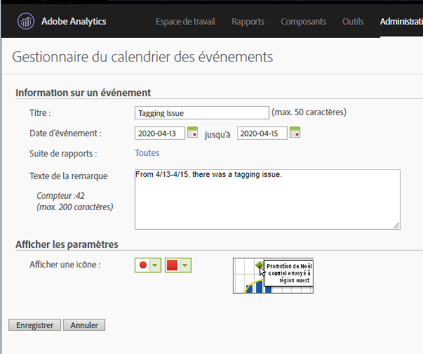

# Communiquer l’impact aux utilisateurs

Si des données sont [affectées par une](../event-impacted.md), il est important de communiquer ce aux utilisateurs de votre organisation. Les sections suivantes présentent différentes manières de communiquer avec les utilisateurs de votre entreprise.

## Communiquer par le biais de descriptions de panneau ou de visualisation

Si un projet Workspace est partagé par des utilisateurs de votre entreprise, vous pouvez communiquer l’impact d’un  par le biais de descriptions de panneau ou de visualisation. Cliquez avec le bouton droit de la souris sur un panneau ou un en-tête de visualisation, puis sélectionnez **[!UICONTROL Modifier la description]**.

## Communiquer au moyen de visualisations textuelles

Vous pouvez également communiquer l’impact d’un  à l’aide de visualisations textuelles dédiées. See [Text visualizations](/help/analyze/analysis-workspace/visualizations/text.md) in the Analyze user guide.

## Utilisation d’un de calendrier dans les rapports et analyses

Si vous utilisez les rapports et analyses, vous pouvez utiliser un de [calendrier](/help/components/t-calendar-event.md) pour mettre en évidence les jours affectés dans n’importe quel rapport de tendances. Cette méthode ne s’applique pas à   Workspace.

1. Accédez à **[!UICONTROL Composants]** > **[!UICONTROL de]** calendrier.
2. Entrez le titre, la plage de dates et le texte de la note de votre choix.
3. Cliquez sur **[!UICONTROL Enregistrer]**.

