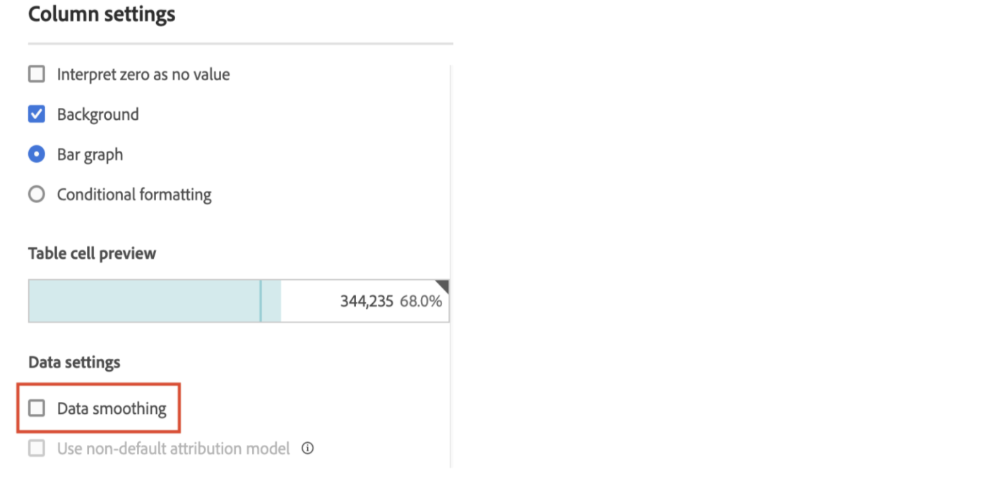

# Lissage des données intelligent

Dans de rares cas, certains facteurs peuvent avoir un impact sur la qualité des données. Le trafic de robots, les modifications de l’implémentation ou les perturbations des services peuvent tous avoir une incidence sur l’intégrité des données collectées. Elles compliquent également l’analyse de la manière dont l’événement peut avoir affecté l’exhaustivité des données.

Dans [Analytics Labs](/help/analyze/labs.md), le lissage intelligent des données est un prototype qui peut vous aider à compléter cette vue en analysant les tendances historiques afin de prédire la valeur de toute mesure au cours de la période concernée. Le prototype applique des algorithmes de machine learning avancés pour tracer les valeurs attendues des mesures sur la période analysée.

## Exécuter le lissage intelligent des données

1. Accédez à Adobe Analytics Labs :
   
1. Lancez le prototype Intelligent Data Smoothing.
   
1. Ajoutez la mesure qui doit être analysée au tableau à structure libre . Le prototype fonctionne uniquement avec une granularité quotidienne. Assurez-vous donc que la dimension du tableau est Jour.
   
1. Choisissez une période plus large que la fenêtre de l’événement, mais assurez-vous qu’elle inclut l’événement.
   
1. Cliquez sur l’icône d’engrenage de la mesure dans le tableau à structure libre.
   
1. Sous [!UICONTROL Paramètres des données], sélectionnez l’option [!UICONTROL Lissage des données].
   
1. Sélectionnez la période correspondant à l’événement et cliquez sur [!UICONTROL Appliquer].
Assurez-vous que la période du lissage des données est un sous-ensemble de la période sélectionnée pour le panneau. Les mesures du tableau et du graphique sont remplacées par les valeurs prédites.
   
