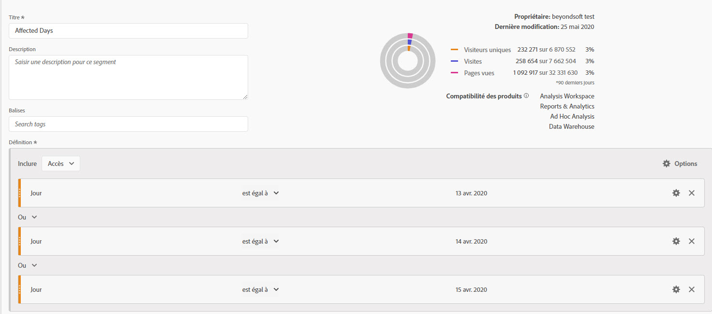
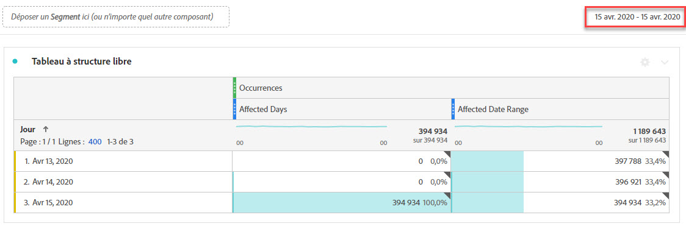
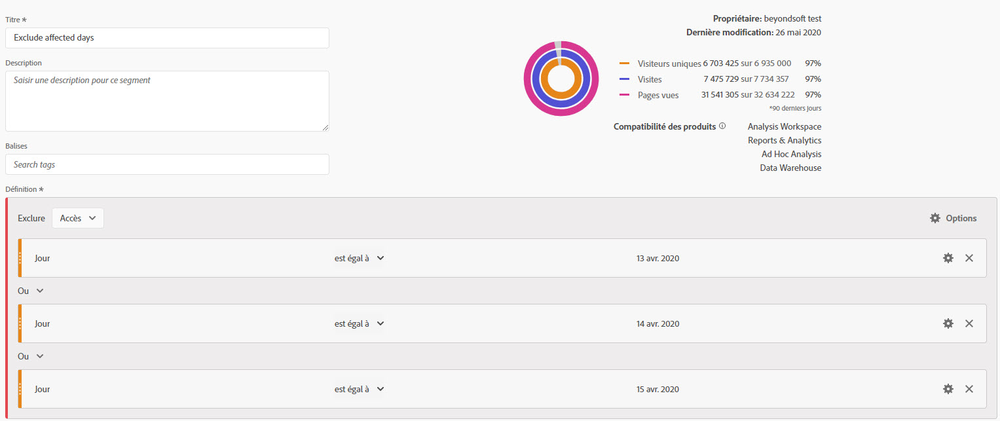
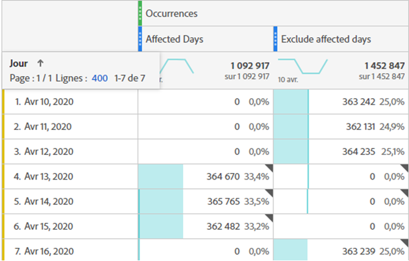
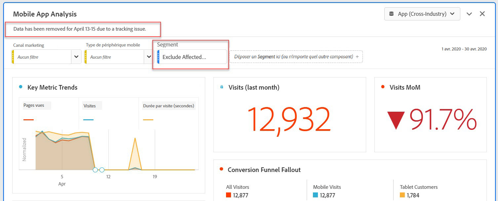
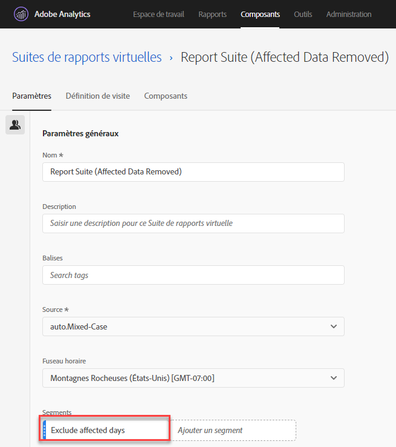

# Exclusion de dates spécifiques dans l’analyse

Si vous disposez de données [impact d’un événement](overview.md), vous pouvez utiliser un segment pour exclure les plages de dates que vous ne souhaitez pas inclure dans vos rapports. La segmentation des dates affectées par les événements peut empêcher votre entreprise de prendre des décisions sur des données partielles.

## Isoler les jours concernés {#isolate}

Créez un segment qui isole le jour ou la période affecté. Ce segment est utile si vous souhaitez vous concentrer uniquement sur les jours problématiques pour afficher plus d’informations sur son impact.

1. Ouvrez le créateur de segments en accédant à **[!UICONTROL Composants]** > **[!UICONTROL Segments]**, puis cliquez sur **[!UICONTROL Ajouter]**.
2. Faites glisser la dimension &quot;Jour&quot; sur le canevas de définition, puis définissez-la sur le jour que vous souhaitez isoler.
3. Répétez l’étape ci-dessus pour chaque jour que vous souhaitez isoler dans votre rapport.

>[!TIP]
>
>Pour remplacer l’instruction OU par une instruction ET, cliquez sur la flèche vers le bas située en regard de OU, puis sélectionnez ET.

Adobe recommande d’utiliser les composants de dimension de dimension orange, et non les composants de période violets. Si vous utilisez des composants de période violets, ils remplacent la période calendaire du projet :

## Exclure les jours concernés {#exclude}

Créez un segment qui exclut le jour ou la période concerné. Ce segment est utile si vous souhaitez exclure les jours qui ont rencontré des problèmes afin de minimiser l’impact sur les rapports globaux.

1. Ouvrez le créateur de segments en accédant à **[!UICONTROL Composants]** > **[!UICONTROL Segments]**, puis cliquez sur **[!UICONTROL Ajouter]**.
2. Dans le coin supérieur droit du canevas de définition de segment, cliquez sur **[!UICONTROL Options]** > **[!UICONTROL Exclure]**.
3. Faites glisser la dimension &quot;Jour&quot; sur le canevas de définition, puis définissez-la sur le jour à supprimer.
4. Répétez l’étape ci-dessus pour chaque jour que vous souhaitez supprimer dans votre rapport.

## Utilisation de ces segments dans les rapports

Une fois le segment d’exclusion créé, vous pouvez l’utiliser exactement comme vous le feriez pour d’autres segments.

### Comparaison de segments dans un rapport de tendances {#compare}

Vous pouvez appliquer les segments &quot;Jours affectés&quot; et &quot;Exclure les jours affectés&quot; dans un rapport afin de les comparer côte à côte. Faites glisser les deux segments au-dessus ou au-dessous d’une mesure pour les comparer :

Si vous ne souhaitez pas afficher de zéros dans le tableau ou les visualisations (ce qui entraîne des creux), activez **[!UICONTROL Interpréter zéro comme n’étant pas une valeur]** sous les paramètres de colonne.

Si vous ne souhaitez pas afficher de zéros dans le tableau ou les visualisations (ce qui entraîne des creux), activez **[!UICONTROL Interpréter zéro comme n’étant pas une valeur]** sous les paramètres de colonne.

### Application du segment d’exclusion à un projet {#apply}

Vous pouvez appliquer le segment &quot;Exclure les jours affectés&quot; à un projet Workspace. Faites glisser le segment d’exclusion vers la section de canevas de Workspace intitulée *Déposer un segment ici*.

>[!TIP]
>
>Incluez une note sur les données exclues dans la description du panneau pour aider ceux qui visualisent le rapport. Cliquez avec le bouton droit sur le titre d’un panneau, puis cliquez sur **[!UICONTROL Modifier la description]**.

### Utilisation du segment d’exclusion dans une suite de rapports virtuelle {#use-vrs}

Vous pouvez utiliser le segment dans une [suite de rapports virtuelle](/help/components/vrs/vrs-about.md) pour exclure plus facilement les données. Cette option est idéale dans la mesure où vous n’avez pas à vous rappeler d’appliquer le segment pour chaque rapport qui inclut la période affectée. Si vous utilisez déjà des suites de rapports virtuelles comme Principale source de données, vous pouvez ajouter le segment à une suite de rapports virtuelle existante.

1. Accédez à **[!UICONTROL Composants]** > **[!UICONTROL Suites de rapports virtuelles]**.
2. Cliquez sur **[!UICONTROL Ajouter]**.
3. Saisissez le nom et la description souhaités pour la suite de rapports virtuelle.
4. Faites glisser le segment d’exclusion vers la zone étiquetée **[!UICONTROL Ajouter un segment]**.
5. Cliquez sur **[!UICONTROL Continuer]** dans le coin supérieur droit, puis cliquez sur **[!UICONTROL Enregistrer]**.

