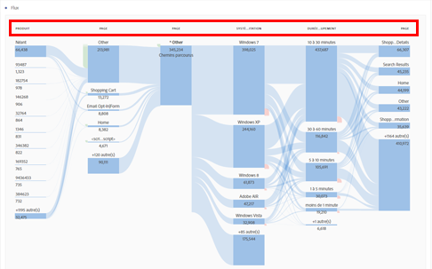

# Rapports Comportement

Les rapports de comportement affichent des informations sur la façon dont les utilisateurs interagissent avec votre site.

Cette page suppose que l&#39;utilisateur maîtrise de base l&#39;utilisation d&#39;Analysis Workspace. See [Create a basic report in Analysis Workspace for Google Analytics users](create-report.md) if you are not yet familiar with the tool in Adobe Analytics.

## Flux de comportement

Le rapport de flux de comportement peut être recréé à l&#39;aide de la visualisation Flux.

1. Cliquez sur l&#39;icône de visualisation à gauche, puis faites glisser une visualisation Flux sur l&#39;espace de travail au-dessus du tableau à structure libre.
2. Locate the **Page** dimension, then click the Arrow icon to reveal page values. Les valeurs de dimension sont colorées jaune.
3. Localisez la valeur de page souhaitée pour commencer avec, puis faites-la glisser dans l&#39;espace intitulé Dimension ou élément au centre.
4. Ce rapport de flux est interactif. Cliquez sur l&#39;une des valeurs pour développer les flux vers les pages suivantes ou précédentes. Utilisez le menu contextuel pour développer ou réduire les colonnes. Différentes dimensions peuvent également être utilisées dans le même rapport de flux.

## Contenu du site - Toutes les pages

Le rapport Pages montre les performances des pages individuelles de votre site.

1. In the Components menu, locate the **Pages** dimension and drag it onto the large freeform table area labeled &#39;Drop a Dimension here&#39;.
2. Drag the desired metrics onto the workspace alongside the automatically created **Occurrences** metric. See the [Metric translation guide](common-metrics.md) for details on how to obtain each respective metric.

Adobe propose d&#39;autres espaces de travail précréés nommés modèles. Le modèle Consommation de contenu (Web) fournit une valeur similaire au rapport Pages.

1. Click *[!UICONTROL Project] &gt; [!UICONTROL New]*, which opens a modal window with project options.
2. Cliquez sur le modèle Consommation de contenu (Web), puis sur Créer.

## Contenu du site - Analyse du contenu

Le rapport d&#39;analyse du contenu permet de surveiller le trafic de la page par structure d&#39;URL. Une mise en œuvre supplémentaire est requise pour l&#39;utilisation dans Analysis Workspace. Adobe conseille de travailler avec un conseiller en implémentation pour veiller à ce que ces données soient collectées avec précision.

## Contenu du site - Pages d&#39;entrée

Le rapport Pages d&#39;entrée montre les principales pages d&#39;entrée de votre site. Landing pages are available in Analysis Workspace as the **Entry Page** dimension.

1. In the Components menu, locate the **Entry Page** dimension and drag it onto the large freeform table area labeled &#39;Drop a Dimension here&#39;.
2. Drag the desired metrics onto the workspace alongside the automatically created **Occurrences** metric. See the [Metric translation guide](common-metrics.md) for details on how to obtain each respective metric.

Adobe recommends using the **Visits** metric for this dimension.

## Contenu du site - Pages de sortie

Le rapport Pages de sortie montre les pages principales qui sont devenues la dernière page de la visite d&#39;une personne. Il est disponible dans Analysis Workspace sous le même nom.

1. In the Components menu, locate the **Exit Page** dimension and drag it onto the large freeform table area labeled &#39;Drop a Dimension here&#39;.
2. Drag the desired metrics onto the workspace alongside the automatically created **Occurrences** metric. See the [Metric translation guide](common-metrics.md) for details on how to obtain each respective metric.

Adobe recommends using the **Visits** metric for this dimension.

## Rapports Vitesse du site

Les rapports de vitesse du site indiquent la rapidité du chargement des pages, ce qui affiche des opportunités d&#39;augmentation des temps de chargement des pages.

Cette fonctionnalité requiert une implémentation supplémentaire sur les deux plateformes ; Adobe conseille de travailler avec un conseiller en implémentation pour vérifier que ces données sont correctement configurées pour Analysis Workspace. The [Performance Timing plugin](../../../implement/js-implementation/plugins/performancetiming.md) is typically assigned to an eVar to obtain performance data in Adobe Analytics.

## Rapports Recherche de site

Les rapports de recherche sur le site fournissent des informations sur la manière dont les visiteurs utilisent les fonctionnalités de recherche interne de votre site.

Cette fonctionnalité requiert une implémentation supplémentaire sur les deux plateformes ; Adobe conseille de travailler avec un conseiller en implémentation pour vérifier que ces données sont correctement configurées pour Analysis Workspace. En règle générale, un terme de recherche interne est extrait d&#39;un paramètre de chaîne de requête et placé dans une evar pour la création de rapports.

## Rapports d&#39;événements

Les événements présentent des différences structurelles majeures entre Google et Adobe Analytics. Les deux nécessitent des modifications d&#39;implémentation supplémentaires pour fonctionner correctement sur leur plateforme respective.

* Dans Google Analytics, les événements sont définis dans votre implémentation sous forme de texte. Les événements comportent des catégories, des actions et des étiquettes.
* Dans Adobe Analytics, les événements sont d&#39;abord configurés dans la console d&#39;administration où un identifiant lui est attribué. Cet identifiant est utilisé dans le code de mise en œuvre. Par exemple :
   1. Vous pouvez définir event 1 dans la console d&#39;administration sous la forme « Inscriptions ».
   2. Dans votre implémentation, vous incluez event 1 dans la variable events sur la page de confirmation d&#39;inscription. Chaque fois que la page de confirmation d&#39;inscription est affichée, event 1 augmente.
   3. Dans Analysis Workspace, « Inscriptions » s&#39;affiche comme mesure pour l&#39;utiliser dans n&#39;importe quel rapport.

Cette fonctionnalité nécessitant des modifications de mise en œuvre, Adobe conseille de travailler avec un conseiller en implémentation pour vérifier que les données sont correctement configurées pour Analysis Workspace.

## Rapports Editeur

Similaire à la manière dont Google requiert une connexion avec Google Ad Manager, Adobe propose un produit dédié pour fournir des informations appelées Adobe Advertizing Cloud. Si votre organisation souhaite utiliser ce produit, contactez le gestionnaire de compte de votre entreprise.
