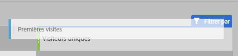
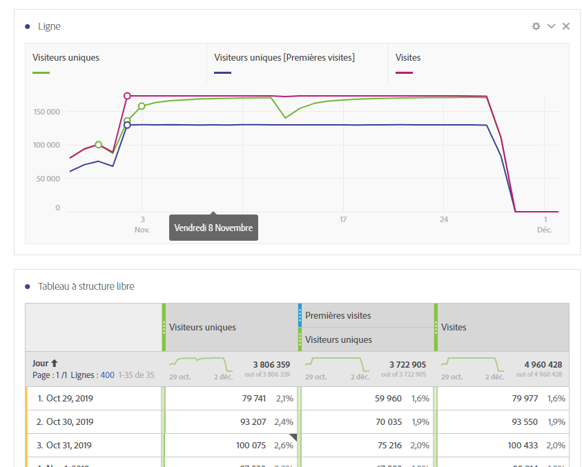

# Guide de traduction des mesures couramment utilisées sur d’autres plateformes

Sur d’autres plateformes, telles que Google Analytics, de nombreux rapports partagent un même nombre de mesures. Utilisez cette page pour comprendre comment recréer les mesures utilisées dans de nombreux rapports.

Pour ajouter plusieurs mesures à un tableau à structure libre d’espace de travail, faites glisser ces mesures depuis la zone de composants située en regard de l’en-tête de mesure sur l’espace de travail :

## Mesures d’acquisition

**Utilisateurs** est à peu près équivalent à **Visiteurs uniques** dans Workspace. Pour en savoir plus, voir la mesure [Visiteurs uniques](/help/components/c-variables/c-metrics/metrics-unique-visitors.md) dans le guide d’utilisation des composants.

Il est possible d’obtenir les **nouveaux utilisateurs** en procédant de la façon suivante :

1. Faites glisser la mesure **Visiteurs uniques** sur l’espace de travail.
2. Faites glisser le segment **Premières visites** au-dessus des en-têtes de mesures Visiteurs uniques :

   

**Sessions** est à peu près équivalent à **Visites** dans Analysis Workspace. Pour en savoir plus, voir la mesure [Visites](/help/components/c-variables/c-metrics/metrics-visit.md) dans le guide d’utilisation des composants.

## Mesures de comportement

Le **Taux de rebond** est disponible en tant que mesure dans Analysis Workspace. Pour en savoir plus, voir la mesure [Taux de rebonds](/help/components/c-variables/c-metrics/metrics-bounce-rate.md) dans le guide d’utilisation des composants.

**Pages/Session** est une mesure calculée. Elle peut être obtenue en procédant de la manière suivante :

1. Si vous avez déjà créé cette mesure calculée, localisez-la sous Mesures et faites-la glisser sur l’espace de travail.
2. Si vous n’avez pas encore créé cette mesure calculée, cliquez sur l’icône **+** en regard de la liste des mesures pour ouvrir le créateur de mesures calculées.
3. Donnez-lui un titre de « Pages vues par visite » et une description, si vous le souhaitez.
4. Définissez le format sur Décimal et le nombre de décimales sur 2.
5. Faites glisser les mesures **Pages vues** et **Visites** sur la zone de définition.
6. Organisez la définition de sorte que la formule soit **Pages vues que divisent les Visites**.

   

7. Cliquez sur Enregistrer pour revenir à votre espace de travail.
8. Faites glisser la mesure calculée nouvellement définie sur l’espace de travail.

   Pour en savoir plus sur les [mesures calculées](/help/components/c-variables/c-metrics/calculated-metric.md), voir le guide d’utilisation des composants.

La **Durée de session moyenne** est à peu près équivalente à la **Durée de la visite (en secondes)**. Pour en savoir plus sur les mesures [Tranche de temps](/help/components/c-variables/c-metrics/metrics-time-spent.md), voir le guide d’utilisation des composants.

## Mesures de conversion

Le **Taux de conversion des objectifs**, la **Réalisation des objectifs** et la **Valeur des objectifs** nécessitent une mise en œuvre supplémentaire sur les deux plateformes. Si votre mise en œuvre prend déjà en charge la dimension produits et l’événement d’achat, tenez compte des étapes suivantes :

1. Faites glisser les mesures **Commandes**, **Chiffre d’affaires** et **Visites** sur l’espace de travail.
1. Créez une mesure calculée de **Commandes par visite**. Utilisez les touches ctrl+clic (Windows) ou cmd+clic (Mac) sur les deux en-têtes de mesures pour les mettre en surbrillance. Faites un clic droit sur l’un des en-têtes, sélectionnez **Créer une mesure d’après la sélection**, puis cliquez sur **Diviser**. Cette nouvelle mesure est similaire à un Taux de conversion des objectifs.
1. Si des décimales sont nécessaires, modifiez la mesure calculée. Cliquez sur le bouton Infos dans l’en-tête de mesure, puis sur l’icône représentant un crayon. Ajoutez 1 ou 2 décimales dans la fenêtre du créateur de mesures calculées, puis cliquez sur Enregistrer.

   

Si votre mise en œuvre ne prend pas encore en charge les données de produit ou de conversion, Adobe conseille de travailler avec un consultant en mise en œuvre pour garantir la qualité et l’intégrité des données.
