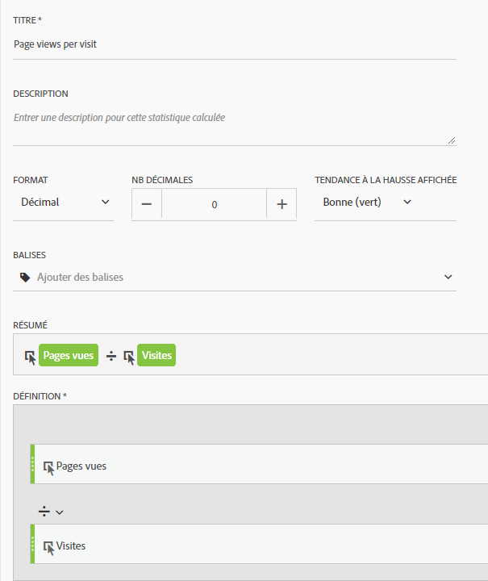

# Mesures couramment utilisées sur d'autres plateformes Guide de traduction

Sur d'autres plateformes, telles que Google Analytics, de nombreux rapports partagent un nombre commun de mesures. Utilisez cette page pour comprendre comment recréer les mesures utilisées dans de nombreux rapports.

Pour ajouter plusieurs mesures à un tableau à structure libre d'espace de travail, faites glisser la mesure à partir de la zone des composants située en regard de l'en-tête de mesure dans l'espace de travail :

## Mesures d'acquisition

**Les utilisateurs** sont approximativement égaux aux **visiteurs uniques** dans Workspace. See the [Unique Visitors](../../../components/c-variables/c-metrics/metrics-unique-visitors.md) metric in the Components user guide for additional details.

**Les nouveaux utilisateurs** peuvent être obtenus selon les critères suivants :

1. Drag the **Unique Visitors** metric onto the workspace.
2. Drag the **First Time Visits** segment above the Unique Visitors metric headers:

   

**Les sessions** sont approximativement égales **aux Visites** dans Analysis Workspace. See the [Visits](../../../components/c-variables/c-metrics/metrics-visit.md) metric in the Components user guide for additional details.

## Mesures de comportement

**Le taux de rebonds** est facile à utiliser dans Analysis Workspace comme mesure. See the [Bounce Rate](../../../components/c-variables/c-metrics/metrics-bounce-rate.md) metric in the Components user guide for additional information.

**Pages/Session** est une mesure calculée. Il peut être obtenu par :

1. Si vous avez déjà créé cette mesure calculée, localisez-la sous Mesures et faites-la glisser sur l'espace de travail.
2. If you have not yet created this calculated metric, click the **+** icon near the metric list to open the Calculated Metric Builder.
3. Attribuez-lui un titre de « Pages vues par visite » et une description si vous le souhaitez.
4. Définissez le format sur Decimal et définissez le nombre de décimales sur 2.
5. Drag the **Page views** metric and **Visits** metric into the definition area.
6. Arrange the definition so the formula is **Page Views divided by Visits**.

   

7. Cliquez sur Enregistrer pour revenir à votre espace de travail.
8. Faites glisser la mesure calculée nouvellement définie sur l'espace de travail.

   Learn more about [Calculated Metrics](../../../components/c-variables/c-metrics/calculated-metric.md) in the Components user guide.

**Durée Session Duration** is approximately equal to **Time Spent per Visit (seconds)**. Learn more about [Time Spent](../../../components/c-variables/c-metrics/metrics-time-spent.md) metrics in the Components user guide.

## Mesures de conversions

**Le taux de conversion d'objectif**, **les remplissages** d'objectif et **la valeur d'objectif** nécessitent une implémentation supplémentaire sur les deux plateformes. Si votre implémentation prend déjà en charge la dimension et l'événement d'achat des produits, tenez compte des étapes suivantes :

1. Drag the **Orders** metric, **Revenue** metric, and **Visits** metric onto the workspace.
1. Create a calculated metric of **Orders per Visit**. Utilisez ctrl + clic (Windows) ou cmd + clic (Mac) sur les deux en-têtes de mesure pour les mettre en évidence. Right-click one of the headers, select **Create Metric From Selection**, then click **Divide**. Cette nouvelle mesure est similaire à un taux de conversion d'objectif.
1. Si des décimales sont nécessaires, modifiez la mesure calculée. Cliquez sur le bouton Informations dans l'en-tête de mesure, puis sur l'icône représentant un crayon. Ajoutez 1 ou 2 décimales dans la fenêtre Créateur de mesures calculées, puis cliquez sur Enregistrer.

   

Si votre mise en œuvre ne tient pas encore compte des données de produit ou de conversion, Adobe conseille de travailler avec un conseiller en implémentation afin de garantir la qualité et l'intégrité des données.
