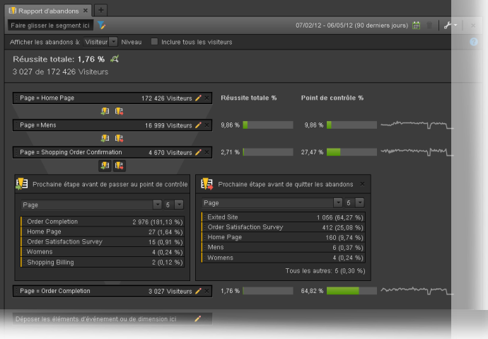

# Rapports Conversions

Une « conversion » est une action effectuée par un visiteur sur votre site qui se traduit directement par les indicateurs clés de votre organisation. Les rapports de conversions affichent des détails sur la conversion des visiteurs.

Cette page suppose que l'utilisateur maîtrise de base l'utilisation d'Analysis Workspace. See [Create a basic report in Analysis Workspace for Google Analytics users](create-report.md) if you are not yet familiar with the tool in Adobe Analytics.

## Rapports Objectifs

Les objectifs fournissent aux utilisateurs Google Analytics la possibilité de définir la conversion d'un site Web. Il s'agit de la méthode par défaut pour créer des entonnoirs, un flux comportemental inversé, des entonnoirs multicanaux et l'attribution. Les objectifs dans Google Analytics ne sont pas rétroactifs et ne peuvent être configurés que sur la page d'administration. En outre, elles sont basées sur une seule page, un événement, une durée de consultation ou un nombre moyen de pages.

Dans Adobe Analytics, le concept d'un objectif n'est pas nécessaire, car les mesures peuvent être appliquées dans n'importe quel contexte. Tant que votre implémentation prend en charge les événements dont vous souhaitez effectuer le suivi, vous pouvez affiner n'importe quel rapport de conversion et obtenir immédiatement des résultats pour les données historiques.

### Visualisation d'entonnoir

Le rapport de visualisation d'entonnoir aide les analystes à se concentrer sur une série particulière d'étapes à convertir. Par exemple, avant d'effectuer un achat, un visiteur sur un site de commerce électronique doit accéder au panier, à la facturation et à la page d'expédition, à la page de paiement et à la page de révision de commande.

Dans Analysis Workspace, ces données peuvent être visualisées à l'aide de la visualisation Abandons.

1. Cliquez sur l'icône des visualisations à gauche, puis faites glisser une visualisation Abandons sur l'espace de travail au-dessus du tableau à structure libre.
2. Click the components icon on the left, then locate the **Pages** dimension.
3. Cliquez sur l'icône en forme de flèche en regard de la dimension Pages pour afficher les valeurs de page. Les valeurs de dimension sont colorées jaune.
4. Localisez la page souhaitée pour agir comme premier touchpoint de contact et faites-la glisser dans l'espace intitulé « Ajouter point de contact » dans la visualisation.
5. Continuez à ajouter des points de contact souhaités en faisant glisser les valeurs de la page vers la visualisation.

La visualisation Abandons n'est pas limitée à la dimension Pages. Toute dimension, mesure ou segment peut servir à concevoir votre rapport d'abandons en fonction des besoins de votre entreprise.

## Rapports Ecommerce

Les rapports Ecommerce sont généralement utilisés par les sites qui vendent des produits ou des services pour mesurer les commandes et les recettes des articles achetés. Cette fonctionnalité est disponible dans Adobe Analytics et est connue sous le nom de rapports de produits.

Les rapports Ecommerce et les rapports de produits dans Adobe Analytics nécessitent des modifications personnalisées de mise en œuvre à utiliser. See the [Products](../../../components/c-variables/dimensionslist/reports-products.md) dimension in the Components user guide for more information.

## Rapports Entonnoir multicanal

Les rapports Entonnoir multicanal fournissent des données supplémentaires sur les canaux marketing au-delà de ce que fournissent les rapports d'acquisition. Ces rapports se concentrent sur la conversion des visiteurs, plutôt que sur la manière dont les visiteurs arrivent sur votre site.

> [!NOTE]
>
> L'utilisation de rapports multicanaux dans Adobe Analytics requiert à la fois la configuration des canaux marketing et une implémentation personnalisée pour tenir compte de la variable products et de l'événement d'achat. Adobe conseille de travailler avec un conseiller en implémentation si ces fonctionnalités ne sont pas encore configurées pour votre suite de rapports.

### Multicanal - Conversions assistées

Les conversions facilitées indiquent le nombre de fois où chaque canal a contribué à une conversion. In Analysis Workspace, the **Order Assists** metric can be used.

1. In the Components menu, locate the **Marketing Channel** dimension and drag it onto the large freeform table area labeled 'Drop a Dimension here'.
2. Drag the **Order Assists** metric on top of the automatically created **Occurrences** metric header to replace it. Si vous le souhaitez, vous pouvez faire glisser des mesures supplémentaires vers l'espace de travail.

### Multicanal - Chemins de conversion principaux

Le rapport Principaux chemins de conversion indique les chemins principaux empruntés par un utilisateur avant la conversion. Analysis Workspace utilise un rapport de flux pour visualiser les principaux chemins de conversion.

1. Cliquez sur l'icône Panneaux à gauche, puis faites glisser un panneau Attribution au-dessus du tableau à structure libre.
2. Click the Components icon on the left, locate the **Marketing Channel** dimension, and drag it to the box labeled 'Add Dimension'.
3. Localisez l'événement de conversion souhaité sous Mesures (par ex. Commandes) et faites-le glisser dans la zone intitulée Ajouter une mesure. Notez que les mesures calculées ne sont pas prises en charge pour le panneau Attribution.
4. Cliquez sur Créer.
5. Dans le rapport résultant, localisez la visualisation « Flux Canal ». Ce flux montre les chemins principaux qu'un visiteur a atteints avant un achat.

Cette visualisation est interactive. Cliquez sur chaque canal pour développer le flux dans l'une ou l'autre direction.

### Canal multicanal - Délai

Ce rapport indique la durée en jours pendant laquelle un visiteur a été converti sur votre site. In Analysis Workspace, this data is available using the **Days Before First Purchase** dimension. Elle n'est disponible que dans le contexte d'un événement d'achat correctement mis en œuvre.

1. In the Components menu, locate the **Days Before First Purchase** dimension and drag it onto the large freeform table area labeled 'Drop a Dimension here'.
2. Drag the desired metrics onto the workspace alongside the automatically created **Occurrences** metric. See the [Metric translation guide](common-metrics.md) for details on how to obtain each respective metric.

Adobe recommends using the **Orders**, **Units**, or **Revenue** metrics with this dimension.

For other types of conversions, including custom events, the **Time Prior to Event** dimension is available. Il indique la durée, en minutes, à laquelle un visiteur a déclenché l'événement au cours de la visite.

1. In the Components menu, locate the **Time Prior to Event** dimension and drag it onto the large freeform table area labeled 'Drop a Dimension here'.
2. Drag the desired metrics onto the workspace alongside the automatically created **Occurrences** metric. See the [Metric translation guide](common-metrics.md) for details on how to obtain each respective metric.

Adobe conseille d'utiliser cette dimension avec des événements personnalisés ou des événements d'achat.

### Multicanal - Longueur chemin

Le rapport Longueur de chemin indique le nombre de canaux atteints avant un événement de conversion. Dans Analysis Workspace, le panneau Attribution contient ces données dans l'une de ses visualisations.

1. Cliquez sur l'icône Panneaux à gauche, puis faites glisser un panneau Attribution au-dessus du tableau à structure libre.
2. Click the Components icon on the left, locate the **Marketing Channel** dimension, and drag it to the box labeled 'Add Dimension'.
3. Localisez l'événement de conversion souhaité sous Mesures (par ex. Commandes) et faites-le glisser dans la zone intitulée Ajouter une mesure. Notez que les mesures calculées ne sont pas prises en charge pour le panneau Attribution.
4. Cliquez sur Créer.
5. Dans le rapport résultant, localisez la visualisation « Points de contact par parcours ». Cet histogramme affiche le nombre de canaux qu'un visiteur a atteints avant un achat.
