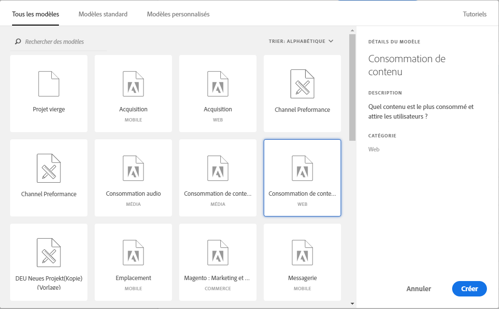

# Création d'un rapport de base dans Analysis Workspace pour les utilisateurs de Google Analytics

Analysis Workspace (l'une des principales fonctionnalités d'Adobe Analytics) permet à un utilisateur d'obtenir des informations sur les données collectées. Les rapports sont très différents entre Google Analytics et Adobe Analytics :

* La structure de création de rapports dans Google Analytics vous permet de sélectionner un type particulier de données, telles que le trafic géographique ou le trafic de référence. La plate-forme utilise une vue de création de rapports préfabriquée basée sur la meilleure méthode prévue pour afficher ces données.
* La structure de création de rapports dans Analysis Workspace fournit un canevas vierge, offrant davantage de souplesse lors de la réunion.

Comme Analysis Workspace fonctionne plus comme un canevas que les rapports préfabriqués, la recréation des rapports de Google Analytics consiste simplement à utiliser les visualisations et les composants appropriés.

## Termes clés utilisés dans Workspace

* **Les panneaux** constituent les principaux blocs de création de l'espace de travail. Dans presque tous les scénarios, un panneau Forme libre est utilisé.
* **Les visualisations** constituent tous les panneaux à structure libre. Leur objectif est de représenter les données dans différents formats. La plupart du temps, le format est un tableau, mais il peut s'agir d'un graphique en anneau ou en courbes. De nombreux rapports dans Google Analytics sont composés de deux visualisations : un graphique en courbes et un tableau à structure libre.
* **Les composants** sont placés dans une visualisation pour renvoyer des données. Les composants peuvent être mixtes de différentes manières pour répondre aux besoins de rapports.
   * **Les dimensions** sont des valeurs de variable et contiennent généralement du texte. notamment le nom de la page, le référent ou le pays géographique. Elles sont généralement répertoriées comme lignes d'un tableau.
   * **Les mesures** désignent généralement un événement ou une conversion d'un tri. Par exemple, les événements courants, tels qu'une page vue, ou quelque chose de plus significatif comme un achat ou un enregistrement. Ils sont le plus souvent affichés sous forme de colonnes dans les tableaux pour indiquer le nombre de fois où un événement s'est produit par dimension.
   * **Les segments** sont un sous-ensemble de vos données et fonctionnent de la même manière que les segments dans Google Analytics. Ils vous permettent de créer des filtres personnalisés, ce qui vous permet de vous concentrer sur une partie spécifique de vos données.
   * **Les plages de dates** vous permettent d'organiser les données en fonction d'un événement. Ils sont le principal segment d'affichage des tendances au fil du temps et sont généralement associés à une mesure.

## Création d'un rapport de base dans Workspace

Créez un rapport Toutes les pages (semblable à celui de Google Analytics) en faisant glisser les composants appropriés sur un canevas de l'espace de travail.

1. Log in to [experiencecloud.adobe.com](https://experiencecloud.adobe.com) using your Adobe ID credentials.
2. Cliquez sur l'icône 9 carrée dans l'angle supérieur droit, puis cliquez sur le logo Analytics coloré.
3. Dans la barre de navigation supérieure, cliquez sur Espace de travail.
4. Cliquez sur le bouton Créer un projet.
5. Dans la fenêtre contextuelle modale, assurez-vous que l'option Projet vierge est sélectionnée, puis cliquez sur Créer.
6. À gauche, une liste de dimensions, de mesures, de segments et de plages de dates s'affiche. Recherchez la dimension Pages (orange), puis faites-la glisser sur la trame intitulée « Déposer une dimension ici ».
7. Un rapport présentant les pages principales pour ce mois est visible. Analysis Workspace automatically populates the report with the [Occurrences](../../../components/c-variables/c-metrics/metrics-occurrences.md) metric.
8. Un tableau dans Google Analytics contient généralement des mesures 7-8. Recherchez la mesure Taux de rebond (vert couleur), puis faites-la glisser à côté de l'en-tête de la mesure Occurrences. Si vous faites glisser la mesure Taux de rebond en regard des Occurrences, les deux mesures sont affichées côte à côte.
9. De nombreuses mesures peuvent être placées côte à côte en faisant glisser des mesures en regard des en-têtes de mesures existants. See [commonly used metrics](common-metrics.md) for information on how to obtain metrics typically used in Google Analytics.

   

## Commencer par un modèle de rapport prédéveloppé dans Workspace

Créez le modèle de consommation de contenu (semblable au rapport Toutes les pages dans Google Analytics) en accédant à un modèle de projet.

1. Cliquez sur le bouton Créer un projet.
2. Recherchez et double-cliquez sur l'icône Consommation de contenu (Web) répertoriée sous Tous les modèles.
3. Parcourez chacune des visualisations préconçues : Flux de page d'entrée, Tableau des pages principales, Flux de page de sortie, Flux de section du site d'entrée et Tableau des sections du site principales.

   

## Testez l'outil

Analysis Workspace étant un outil de création de rapports, il n'a aucun impact sur la collecte de données. Il n'y a aucune incidence sur la glissement sans discernement des composants dans un projet pour voir ce qui fonctionne. Faites glisser différentes combinaisons de dimensions et de mesures dans votre projet d'espace de travail pour voir ce qui est disponible.

Si vous faites glisser accidentellement un composant non valide vers votre projet d'espace de travail ou si vous souhaitez revenir à une étape, appuyez sur Ctrl + Z (Windows) ou cmd + Z (Mac) pour annuler la dernière action effectuée. You can also start with a clean slate by clicking *[!UICONTROL Project]&gt;[!UICONTROL New]* in the upper left menu.

Adobe a placé de nombreuses fonctionnalités dans Analysis Workspace dans le menu contextuel contextuel. La plupart des visualisations et des composants peuvent faire l'objet d'un clic droit pour une analyse et une interaction plus détaillées. Pensez à cliquer avec le bouton droit de la souris sur les composants de votre espace de travail pour voir quelles options sont disponibles.

## déterminer les dimensions et les mesures à utiliser

Si vous vous sentez à l'aise avec Analysis Workspace et souhaitez recréer un rapport spécifique généralement affiché dans Google Analytics, localisez le rapport sur la page correspondante :

* [Rapports en temps réel](realtime-reports.md)
* [Rapports d'audience](audience-reports.md)
* [Rapports d'acquisition](acquisition-reports.md)
* [Rapports Comportement](behavior-reports.md)
* [Rapports Conversions](conversions-reports.md)
