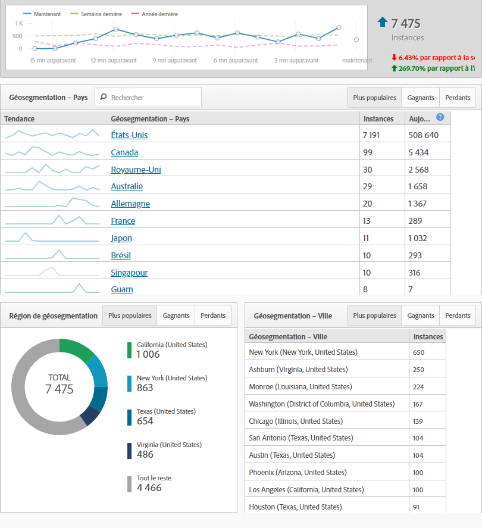
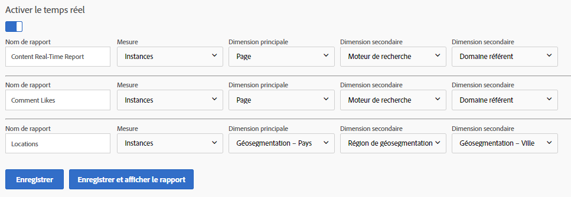

# Rapports en temps réel

Les rapports en temps réel indiquent ce qui se passe actuellement sur votre site. Ces types de rapports sont particulièrement utiles pour obtenir des résultats immédiats des mises à jour apportées à votre site. Par exemple, une entreprise qui exécute une vente sur Black Friday peut évaluer le trafic vers des pages spécifiques et déterminer les ventes qui sont prioritaires en fonction des performances dans ce moment.

Les rapports en temps réel sont l'une des quelques fonctionnalités qui n'ont pas encore été introduites dans Analysis Workspace. Utilisez les rapports et analyses pour obtenir ces données. Ils nécessitent une configuration simple pour commencer à collecter des données.

Pour atteindre la page de configuration des rapports en temps réel (autorisations d'administrateur requises) :

1. Click [!UICONTROL Reports] in the Adobe Analytics header navigation.
2. In the left menu, Click *[!UICONTROL Site Metrics]* &gt; *[!UICONTROL Real-Time]*.
3. Si la suite de rapports n'est pas encore activée, un message s'affiche avec un lien pour configurer la suite de rapports. If the report suite has real-time enabled, click [!UICONTROL Configure] near the real-time report's title.

Adobe autorise trois rapports en temps réel à collecter les données simultanément. Chacun doit être configuré avant de commencer à collecter les données en temps réel.

## Emplacements en temps réel

Les emplacements en temps réel indiquent où résident les visiteurs lorsqu'ils se rendent sur votre site au moment actuel. Pour configurer l'un de vos trois rapports en temps réel pour afficher les données de lieu :

1. Click [!UICONTROL Configure] near the real-time report's title.
2. Sous l'un des emplacements de rapport en temps réel :
   * Nommez votre rapport en temps réel ; par exemple, Emplacements.
   * Les instances sont généralement utilisées comme mesure. Actuellement, les utilisateurs/visiteurs uniques ne sont pas disponibles dans les rapports en temps réel.
   * Pour la dimension principale, la géosegmentation Pays est généralement utilisée. La région geosegmentation, la géosegmentation des Etats-Unis et la ville geosegmentation sont également disponibles.
   * Pour les deux dimensions secondaires, utilisez les données supplémentaires préférées que vous souhaitez voir pour ce trafic. Les dimensions secondaires n'ont pas besoin d'être spécifiques à l'emplacement.
3. Click [!UICONTROL Save and View Report].

## Sources de trafic en temps réel

Les sources de trafic en temps réel indiquent d'où proviennent les visiteurs lorsqu'ils visitent votre site au moment actuel. Pour configurer l'un de vos trois rapports en temps réel pour afficher les données des sources de trafic :

1. Cliquez sur « Configurer » près du titre du rapport en temps réel.
2. Sous l'un des emplacements de rapport en temps réel :
   * Nommez votre rapport en temps réel ; par exemple, « Sources de trafic ».
   * Les instances sont généralement utilisées comme mesure. Actuellement, les utilisateurs/visiteurs uniques ne sont pas disponibles dans les rapports en temps réel.
   * Pour la dimension principale, le domaine référent est généralement utilisé. Moteur de recherche et Mot-clé de recherche sont également disponibles.
   * Pour les deux dimensions secondaires, utilisez les données supplémentaires préférées que vous souhaitez voir pour ce trafic. Les dimensions secondaires n'ont pas besoin d'être spécifiques aux sources de trafic.
3. Click [!UICONTROL Save and View Report].

## Contenu en temps réel

Le contenu en temps réel indique les pages que vos visiteurs consultent actuellement. Pour configurer l'un de vos trois rapports en temps réel pour afficher les données de contenu :

1. Click [!UICONTROL Configure] near the real-time report's title.
2. Sous l'un des emplacements de rapport en temps réel :
   * Nommez votre rapport en temps réel ; par exemple, « Contenu ».
   * Les instances sont généralement utilisées comme mesure. Actuellement, les utilisateurs/visiteurs uniques ne sont pas disponibles dans les rapports en temps réel.
   * Pour la dimension principale, la page est généralement utilisée. Section et serveur du site sont également disponibles si votre implémentation définit ces variables.
   * Pour les deux dimensions secondaires, utilisez les données supplémentaires préférées que vous souhaitez voir pour ce trafic. Les dimensions secondaires n'ont pas besoin d'être spécifiques au contenu.
3. Click [!UICONTROL Save and View Report].

## Événements en temps réel

Les événements en temps réel indiquent les événements qui se produisent le plus sur votre site. Dans Google Analytics, un événement capture le nombre d'occurrences d'une action spécifique (généralement une action sans rapport avec une page vue). Les événements GA sont envoyés avec une catégorie, une étiquette et une action. Dans Adobe Analytics, les événements personnalisés sont des mesures auxquelles des noms conviviaux sont attribués dans la console d'administration et qui peuvent être analysés avec n'importe quelle dimension. Si vous recherchez une dimension dans Adobe Analytics semblable aux événements Google Analytics, envisagez d'appliquer la dimension Lien personnalisé, souvent utilisée comme fourre-tout pour la collecte de données sans rapport avec les pages vues (outre les liens de sortie - pour les sorties - et les liens de téléchargement - pour les téléchargements).

> [!NOTE] Lors de l'utilisation d'événements personnalisés dans les rapports en temps réel, la valeur de dimension doit être définie dans le même accès que l'événement personnalisé. Par exemple, si vous affichez un événement personnalisé « Inscriptions » pour la dimension « Domaine référent », aucune donnée ne serait renvoyée sans mise en œuvre supplémentaire. Puisque le domaine référent apparaît uniquement sur le premier accès et qu'un événement personnalisé s'affiche généralement plus tard dans la visite, les données ne peuvent pas être associées aux rapports en temps réel. Ces données sont disponibles à l'aide d'Analysis Workspace à l'aide de la latence de traitement standard, qui est habituellement de 30-90 minutes.

## Conversions en temps réel

Les conversions en temps réel présentent des données différemment entre les plateformes. Les objectifs dans Google Analytics sont les mesures et les événements de réussite dans Adobe Analytics. Vous pouvez utiliser la plupart des mesures dans Adobe Analytics (mesures personnalisées comme les événements de réussite et les mesures standard telles que les recettes) dans les rapports en temps réel. Comme Google Analytics, vous pouvez également appliquer des dimensions telles que le nom du produit, le code de suivi et les performances des campagnes dans les rapports en temps réel.

1. Click [!UICONTROL Configure] near the real-time report's title.
2. Sous l'un des emplacements de rapport en temps réel :
   * Nommez votre rapport en temps réel ; par exemple, « Conversions ».
   * Les instances sont généralement utilisées comme mesure. Actuellement, les utilisateurs/visiteurs uniques ne sont pas disponibles dans les rapports en temps réel.
   * Pour la dimension principale, le code de suivi est généralement utilisé. La dimension Produits est également disponible si votre implémentation l'utilise.
   * Pour les deux dimensions secondaires, utilisez les données supplémentaires préférées que vous souhaitez voir pour ce trafic. Les dimensions secondaires n'ont pas besoin d'être spécifiques aux conversions.
3. Click [!UICONTROL Save and View Report].

> [!NOTE] Si vous utilisez des événements en dehors des instances, tels que Commandes, assurez-vous que votre implémentation définit la dimension et l'événement sur le même accès. Si les dimensions et les événements ne se déclenchent pas sur le même accès, ces données sont disponibles dans Analysis Workspace à l'aide de la latence de traitement standard, qui est habituellement de 30-90 minutes.
