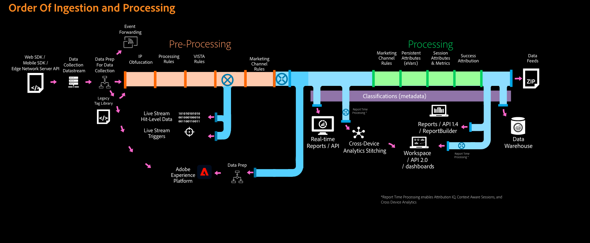

# Ordre de traitement des données dans Adobe Analytics

Adobe offre de nombreuses façons de modifier ou de manipuler les données avant qu’elles n’apparaissent dans les rapports. Cette page indique l’ordre dans lequel différentes fonctionnalités d’Adobe Analytics traitent les données. Vous pouvez utiliser cette liste pour résoudre les incohérences entre les données ou déterminer la meilleure fonctionnalité à utiliser lorsque des ajustements des données sont nécessaires.

## Données avant envoi à Adobe

Avant d’envoyer les données à Adobe, elles sont généralement compilées côté client à l’aide de l’une des méthodes suivantes :

* **AppMeasurement** : fichier JavaScript hébergé sur votre site et référencé sur chaque page. Les données sont envoyées directement à Adobe Analytics.
* **SDK Web Adobe Experience Platform** : fichier JavaScript hébergé sur votre site et référencé sur chaque page. Les données sont envoyées à l’Edge Network Adobe Experience Platform.
* **Balises dans la collecte de données Adobe Experience Cloud** : fichier JavaScript référencé sur chaque page, contenant les règles créées dans l’interface utilisateur de collecte de données. L’extension Adobe Analytics offre un moyen plus simple de mettre en œuvre AppMeasurement. L’extension SDK Web offre un moyen plus facile de mettre en œuvre le SDK Web.

Si vous envoyez des données à l’Edge Network, vous pouvez les configurer pour transférer des données vers Adobe Analytics (ainsi que de nombreuses autres solutions Adobe Experience Cloud). Quelle que soit la méthode de mise en œuvre, une demande d’image contenant les variables souhaitées est envoyée aux serveurs de collecte de données d’Adobe.

## Données telles qu’elles arrivent aux serveurs de collecte de données Adobe Analytics

Une fois les données envoyées à Adobe Analytics, les fonctionnalités suivantes les ajustent selon les besoins :

1. **Tables de recherche** : dimensions qui reposent sur des tables de recherche interne Adobe (par exemple, la dimension [Navigateur](/help/components/dimensions/browser.md)) sont mises en correspondance avec la valeur associée.
2. [**Variables dynamiques**](/help/implement/vars/page-vars/dynamic-variables.md) : si une variable dynamique est vue dans une partie d’une demande d’image, la valeur sera copiée et traitée comme une valeur indépendante à l’avenir.
3. [**Règles de robots**](/help/admin/admin/c-manage-report-suites/c-edit-report-suites/general/bot-removal/bot-rules.md) : appliquez un filtrage de robots standard ou personnalisé pour exclure ces données des rapports.
4. [**Règles de traitement**](/help/admin/admin/c-manage-report-suites/c-edit-report-suites/general/c-processing-rules/processing-rules.md) : règles personnalisées appliquées à vos données par votre organisation. Inclut le mappage de [Variables de données contextuelles](/help/implement/vars/page-vars/contextdata.md) à leur variable respective.
5. **Règles VISTA** : règles flexibles personnalisées appliquées à vos données par un consultant Adobe. Les règles VISTA peuvent éventuellement s’exécuter avant ou après les règles de traitement, selon les besoins de votre entreprise. La plupart des règles VISTA s’exécutent généralement après les règles de traitement, mais chaque organisation est configurée différemment. Contactez votre équipe de compte d’Adobe pour plus d’informations sur les règles VISTA existantes.
6. [**Règles de traitement des canaux marketing**](/help/admin/admin/c-manage-report-suites/c-edit-report-suites/marketing-channels/c-rules.md) : vous pouvez utiliser les [règles de traitement](/help/admin/admin/c-manage-report-suites/c-edit-report-suites/general/c-processing-rules/processing-rules.md) pour préparer les données à utiliser dans les règles de traitement des canaux marketing.
7. **Données de géolocalisation** : les dimensions reposant sur la recherche d’adresses IP (par exemple, la dimension [Pays](/help/components/dimensions/countries.md)) sont renseignées.
8. [**Dissimulation d’adresses IP**](/help/admin/admin/c-manage-report-suites/c-edit-report-suites/general/general-acct-settings-admin.md) : si votre entreprise a choisi de dissimuler les adresses IP dans les données brutes, cela s’effectue une fois toutes les autres fonctions de traitement terminées.

À ce stade, l’accès individuel est enregistré dans les tableaux de données de la suite de rapports. Après l’intervalle de [Latence](latency.md) standard, il est disponible dans les rapports.

## Modification des données après leur traitement

Les données dans Adobe Analytics sont pour la plupart permanentes. Cependant, certaines fonctionnalités permettent d’ajuster ou de supprimer des données sélectives 

* [**API de réparation des données**](https://developer.adobe.com/analytics-apis/docs/2.0/guides/endpoints/data-repair/) : modifiez certaines colonnes ou supprimez les lignes de données de votre choix.
* [**Gouvernance des données**](/help/admin/admin/c-data-governance/an-gdpr-workflow.md) : accédez aux demandes de confidentialité pour supprimer définitivement des données.
* [**Classifications**](/help/components/classifications/c-classifications.md) : créez des dimensions d’après des règles ou des données téléchargées qui vous permettent d’organiser les données différemment. Les données sous-jacentes de la suite de rapports ne sont pas modifiées. Vous pouvez donc modifier ou remplacer librement les données de classification.
* [**Suites de rapports virtuelles**](/help/components/vrs/vrs-about.md) : créez une autre vue de suite de rapports qui peut modifier le délai d’expiration de la visite ou autoriser [Analytics sur l’ensemble des appareils](/help/components/cda/overview.md).
